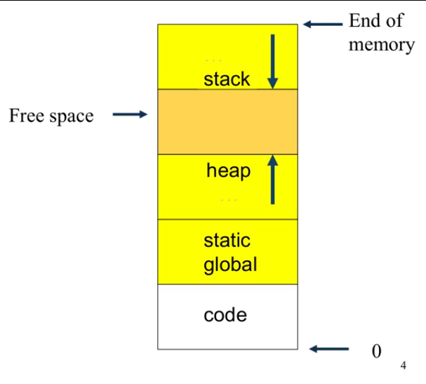
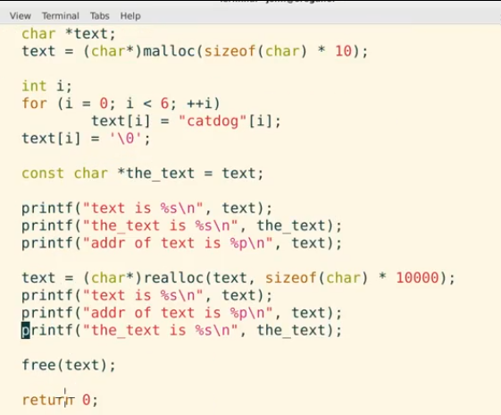
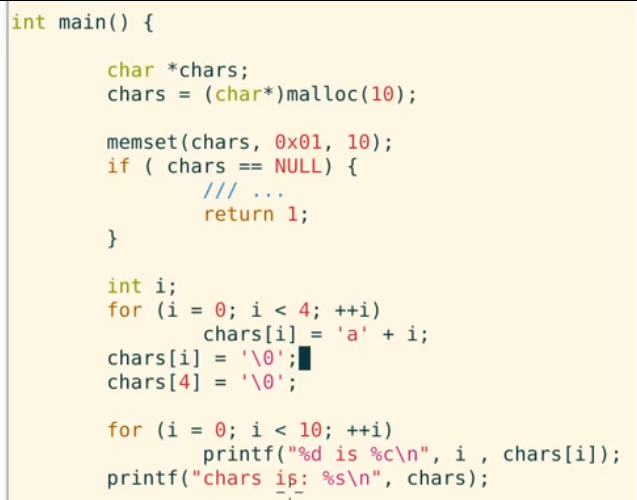
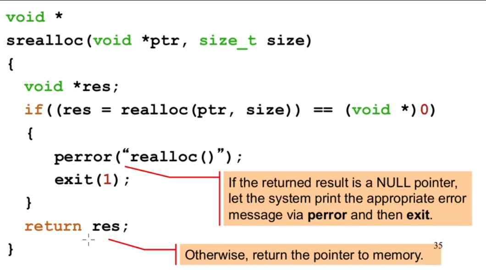

**COMP2017: Systems Programming** (C)
>Introduction to memory model with C
Memory management and aggregate data types in C
Parallelism and concurrency and programming in C

c:		Character
d/i:	Signed decimal integer
e/E: 	Scientific notation (mantissa/exponent)
f:		Decimal floating point
g:		Uses the shorter of %e or %f
G:		Uses the shorter of %E or %f
o:		Signed octal
s:		String of characters
u:		Unsigned decimal integer
x:		Unsigned hexadecimal integer
X:		Unsigned hexadecimal integer (CAPS)
p:		Pointer address
n:		Nothing printed
%:		Character	


# TEXTBOOK
# 1.2 INFORMATION IS BITS + CONTEXT
*source file* the actual code
*source program* sequence of bits, organised in bytes
* text represented through ASCII standard, unique byte-size integer value --> text
* machine representations of numbers arent the same as real numbers, just approximations
* different data objects differ based on their context of viewing; same bytes could represent an integer, string, machine insturction, ...

## 1.2 Programs Are Translated by Other Programs into Different Forms
* code transformed into low-level machine-langauge instructions
* source program > pre-processor > compiler (translates file to contain assembly-langauge program) > assembler (becomes machine instructions) > linker (brings needed functions together, like printf.o w/ hello.o program) > execution of program

## 1.3 It Pays to Understand How Compilation Systems Work

* optimizing program performance: what functions are more efficent than others, whats the overhead, ...
* link-time errrs: linker is the source of a lot of problems
* avoiding security holes: buffer overflow vulnerabilities, need to understand the consequences of the way data is handled and stored


# WEEK 1
## LECTURE
* python and java are *managed langauges*
* C doesnt have garbage collector, no saftey, no overhead
* programmer must understand the MEMORY model

* things are stored in memory, adresses and values
*address* the location in memory of the value `0x00A7`
*value* an arbitrary number of bits, first bit stored at the address
* subsequent adresses go up by bytes, (8 bits)
* have to explicit about how much information `32 bits`, `3gb`
	* how is the information encoded, a bit sequence to decypher

*how much memory do we have*
* address range
*where is a value we want to retrive*
`int x = 0;
&x --> the starting memory adress`

*where does a new value go*
* need to consider what space is avalible

*how can we refer to an area of memory for somewher else*
* give them the address

* you can put memory adresses in a memory adress :o
* using da camera: memory > main memory > system memory > bus h/w > microcontroller (cpu) > camera chip
* cascadingly copied, and copied back to verify

* memory relies on: correct values being coppied, from and to the correct address, at the right time (e.g. local/global variables, different actors)
* hetrogenous compling and whatnot because of different computer architectures

**history**
* 1970s, things in bytecode or assembly, problem of portability
* C provided another layer of abstraction that could run on multiple machines
* C doesnt have: objects and classes, templates, operator/function overloading
C contains:
* preprocessing langauge (text, macro language) 
	* for purely text based languages: taking in text, modifiying, outputting text
	* definition of macros, include files, conditional compiling
* C language


`echo $?` return of the outcome (in int) of the last command
`cat <file.c>` print code
`gcc -o hello_binary <file.c>` runs it?

* explore all da possibilites
* bufferoverflow: when a value exceeeds the memory allocated to it
* you can only intialize varaible once `int a =`, `a = `

## java vs c
* C is a simple memory model, procedule, Java has 1 million+ classes, OOP
* C uses pointers, bit-level operators
	*bit-level operators* can extract the specific 0's and 1's you want of a byte, manipulation of memory at the bit level
* Arrays in C have contigous regions in memory (array indexing using pointer indexing)

both:
* block structures
* control structes `if, else, while ...` the same
* primative array --> looks like c (c has no .length)
* c: unsigned int vs signed int

**preprocessor**
* C macros `#define`
* Call-by-name
```c
int main (int argc, char **argv){}
int main (void)
void main (void)
```
* in C, you can only have the *main* which are unique
* C, you can use function names in other contexts?
* `unit_16t`, have to be upfront in declarations, of amount of memory
* C: conditional compilation (have to use function callbacks in java, runtime class allocation)

```c
int a[5] = {7, -1, 3, 5, 2000}; //will create contigous memory of the array, each bit the size of the integer
//when we use a, substitues with the value of the memory adress it points to. i.e. int 0x0030[5]; 
```

* last character of array is a null byte `\0`
* c strings are arrays of characters
* char is 8 bites, range of 256 values, null byte is 0

*sizeof* macro, used to query the size of a datatype --> returns int amount of bytes `sizeof int`
* cannot be used for dynamic memory

* previously, declarations only at block start, now
`for (int i = 0; i < n; i++)`
* C is only better than java in performance for low overheads, less memory


* statement is anything that has a semi column following it
```c
do <stmnt>
while (<expr>)
//
for(<init expr>; <boolean-exp>; <continuation-expr>) <stmt>

for (x = 0; x < 100; x++)
	counter[x] = x;

return <optional expression>
break
continue 

switch(...)
{
	case <constant-expression>: <statement-sequence>; //has to be specific
	case ...: ...
	default: ...
}
```
* in the file: source code, functions, variables outside function
* function declarations not in it (information about the function)

* object file: binary file placeholder for a final binary file

* "" > for the user?
```c
#include "foo.h"
```

# WEEK 2
## TUTORIAL
* C is statically typed, variable has to have a type associated with it `int a = 2;`

>char and unsigned char
int and unsigned int
short and unsigned short
long and unsigned long
double
float

* unsigned types can be prepended to integer types
* arrays declared like


## TUTORIAL
* header file looks into user included?
`grep puts`
`cd -`
`man 3 puts` //goes to the manual


```c
#include <stdio.h>
int main(int argc, char** argv){

	char* greeting = argv[1];


	return 0;
}
```
`**` nested pointer, `*` single pointer
* `fgetsc` one chracter from the file strema
* `fgets`, i just want to read a line, as an array of characters?
	* can fail if you put in more text than buffer
* `scanf`, i want to read the stdin buffer in a formatted way (can fail if buffer is not formatted well, your cursor can become in an unknown position)


* areas of memory, 3: .text (ax), .data (wa) (global), .bss (wa) (static)
* strings are stored in program code memory, only used for execution (read only) 
* so in the case of the array, the string literal is copied from program code into the stack frame at run time? actually dont know
* stack memory starts with high memory adresses and goes back


* Sizeof(array) /  sizeof(array[0]) is the same as Len(array) ?, cant do this with pointers


```c
int ** p = "...."
*p = p[0]
*(p + 10) = p[10]
*(p) + 10 = p[0] + 10
```


*dereferences* get the value associated with the memory pointed to?
`&r[20] = &*(r+20)=r+20`

```c

int** y = ... //its like a 2 dimensional array
int* x = ...

*y -> int* //will be like {1, 2, 3}
*x -> int //will be like 1
**y -> int //will be 1
can do y[0][1]

```


```c
&((r[5])[5])
*(r+5) + 5


(*(r+5)) + 5

```
# LECTURE 2
C simple tyPes: float, int, char; each "implies an interpretation of the bit pattern stored in the memory"
* on declaration, reserve memory of the type (int automatically allocates int amount of memory, initalizing fills in the bits where its located)

* arrays, printing before assigning values to an index is random data

`char stringName[] = "text";` will intitlaise an array of length 5, with null byte at the end
* printing string --> prints the bytes next to it until there is a null byte

doing: `char x[10]; | x = "hello"` doesnt work, it cant reallocate memory
* to refer to the adress of an array, its just the array name

* remember! pointer point to a memory adress
*address operator* & (can also be bitwise & operator)
*indirection operator* * (can also be multiplication)
* if it has * , it holds a memory adress `int *ptr | ptr = &number`
* want to print * ptr, to get the actual thing, ptr prints the adress
* size of pointer is dependant on 32/64bit (4bytes/8bytes)
* type declaration of pointer retrives the length of its type (int will retrive 8)

`int **tricky` a pointer called tricky, holds adress of another pointer, that holds the address of an int
* derefenerencing, unraveling the indirection through `*`
```c
char msg[] = "Hello!";
char *str = &msg[0];

//for H in memory, can be acsessed by: msg[0], str[0], *str
// for E in memory, can be accessed by: msg[1], str[1], *(str+1)
```
* can also do this to arrays!
* `*p` is the first element of array p

*way to iterate through string*
```c
char *text = "hello!"
char *str = text;

while (*str)
	str++;
```


* pointers are essential when using dynamic data structures (not static!)


Interpretations of `int **data`;
1. Pointer to pointer to single int values					size [=1, =1] *where > is >=	
2. Array of addresses that point to a single int 			size [>1, =1]
3. Address that points to one array of int values			size [=1, >1]
4. Array of addresses that point to arrays of int values	size [>1, >1] 

* once a static variable is initialised, it cannot be reintialised? its value is updated (its value is not forogtten?)

`*(argv + 1)` --> first argument as a C string
`*(*(argv + 4) + 1)` --> second chracter of 5th argument = `*(argv[4] + 1)`

```c
void *get_adress(datatype *data, int n) {
	unsigned char *ptr = (unsigned char*) data;
			return (void*) (ptr + n);
}
```
* choose a diffent data type to change pointer arthymetic
`sizeof()` operator returns the number of bytes used to represent the given type/expression `sizeof(int) | sizeof(1)`, pointers will give back the memory adress

* CHAR_MIN, CHAR_MAX
* *const* operator is fixed data, control behavior of interfaces, non-writeable
* `char buffer[N]` -> `char ret = fgets(buffer, 7, fp);`
* fgets reserve last thing for nullbyte

```c
int main(){
	FILE *fp;
	fp = fopen("hello.c", "r");
	if (fp == NULL) {
		fprintf(stderr, "Failed...");
		return 1;
	}

	char buffer [7]
	char ret = fgets(buffer, 7, fp);
	if (ret == NULL) {
		fprintf(stderr, "Failed...");
		return 2;
	}
	int i;
	for (i = 0; i < 7; i ++){
		printf("%d %c\n", buffer[i], buffer[i]);
	}
	printf("%s\n", buffer); //fgets inserts a null byte

}
```


## 02 TUTORIAL

* create a tempory pointer for a sequence in a function, so you dont lose start of pointer
* strace
* local memory if within other functions, need to modify actual memory adresses to do otherwise
* push things out to stderr, like `fputs("...", stderr))`

* redirection for test ./ccode < test.in

`./code test1.in | diff - test1.out`

* -debug cool?

>Small tip for anyone who did INFO1110 last year sem 1 - as part of our acorn assignment, we got given a scaffold for running our e2e tests. If you take a look @ that, you can get an idea of what the bash script may look like !

* char 0 == 48

```c
int main(){
	int a = 5;
	int* p = &a;
	void* ptr = p;

	int* b = (int*) ptr; // () is the cast
}
```

#WEEK 4 (STRUCTURES)
## LECTURE

```c
int count_chr(char *text, char target) {

	if (text == NULL) {
		return 0; //should have considered this
	}

	int count = 0;

	char *cptr = text; //refers to first character of text 
	while (*cptr != '\0') {

		// check if character is equal to target

		char ch = *cptr;
		if (ch == target)
			count++;

		cptr++; //moves the pointer down the string
	}

	return count;
}
```

*structures* aggregations, multiple datatypes embedded into one (like a class)
* its stored as an array, continous memory

usecase: like a library catalog that holds strings, ints, whatnot

```c
struct date
{
	enum day_name	day;
	int 			day_num;
	enum month_name	month;
	int 			year;
};

struct data v; //gotta refer to the struct
```
*singleton* like thing
```c
struct date
{ //definition
	enum day_name	day;
	int 			day_num;
	enum month_name	month;
	int 			year;
} Big_day { //declaration of variable of this type
	Mon, 7, Jan, 1980
}; //intialization

foo(){
	struct date 	moonlanding;
	//this requires 16 bytes, reserves 16 bytes! (with garbage values)
	struct date		deadline = {day_undef, 1, Jan, 2000}; //undefined if wrong amount of arguments
	//reserves 16 bytes!
	struct date 	*completion;
	//reserves 8 bytes (memory adress) that would have garbage values?
}
``` 	

* structures dont have methods

```c
struct date bigday;
int 	the year;
theyear = bigday.year //dot operator, nominate an element of the structure
//does a pointer arithmatic, jumps to correct byte
```

* structs cant have variable sized content (its size needs to be known in compilation)
* putting in `int args[]` would assume it to be a pointer, allocating 8 bytes 

* can put in a struct into a struct?? (also recursively)

```c
struct date bigday;
struct date *mydate; //holds an address (pointer)
int 	theyear;
mydate = &bigday;

theyear = mydate->year; //is the equivilent of (*mydate).year
```

*typedef* can create synonyms
* kinda shouldnt use it, just aesthetics
```c
typedef struct date{
	data;
} Date;

Date Big_day;
```

* duplicates structs when parsing it into functions
* if your parsing a struct into a function, it only changes things locally
* pointers allow you to change memory instead of duplicating memory, returning things back,,

```c
struct customer 	s1;
struct salesrep 	s2;
struct sale transact(struct customer s1, struct salesrep s2);

struct sale transact(struct customer s1, struct salesrep
	s2)
{
	struct sale sl;
	...
	return sl;

}
```

* `const char *name` c string i think
* cpus optimised to fill *words*, 32 bit machine its 4 bytes, 64 -> 8 bytes
* structs add padding if it doesnt it fill it up, a single char in a struct will fetch 4 bytes
	* can test by seeing how far different variables are from each other
	* can save space by rearranging fields
* can put in global scope?

**unions**
* several varient of a structure, doesnt consume more memory
* can overload the memory depending on what you call it with

```c
// books: author, ISBM
// films: director, producer

enum hoding_type{book, film};
struct catalog
{
	char *title;
	enum holding_type type;
	union //this thing, switches  
	{
		struct/* book */
		{
			char *author;
			char *isbn;
		} book_info;
		struct /* film */
		{
			char * director;
			char * producer;
		} film_info;
	} info;
}
```
* modifying memory in a union may fuck things up 
* a switch statement with x.holding_type,, confirms which switcher it is
`printf("size: %uz\n", (void*)&(structName.valueA) - (void*)&(structName.valueB)` //recast it as a void pointer, perform pointer arithmatic

**bitfields**
* specify a size in bits, doesnt do padding

```c
struct IOdev
{
	unisigned R_W: 1;
	unisigned Dirn: 8;
	unisigned mode: 3;
	unisigned pad: 4;
};

struct IOdev dev = {1, 0, 7};

void main()
{
	printf("mode = %d\n", dev.mode);
}
```
* you gotta use bitwise operators to navigate (x>>15)
* `>>, <<, &, |, ^, ~`
```c
R_W = x>>15 //moves bit to the end
Dim = (x>>7);
Dim = (x>>7) & OxFF;
```

**files**
* files are an abstraction, through OS System Calls you can get things
* streams, source of data that continously produces new data, its open ended
```c
FILE *fopen(const char *path, const char *mode);
File *myfile = fopen ("turtles.text", "w");
fclose();

ftell() //look at where you are relative to beginning of file
fseek() //jump around file

while ( ! feof(stdin)) {} //EOF check
```
* unbuffered, fully buffered, line buffered
* flush on buffered, stop everything on this buffering mode until we can confirm it has been written (on unbuffered, it stops it)

##TUTORIAL
* you can reinitialize a struct, unlike an array: through a function only
```c
struct person create person(const char *name, int age) {
	struct person p;
	strcpy(p.name, name);
	p.age = age;
	return p;
}
```
* fwrite buffers the data
* if program crashes, the buffer is gone (flushed)
`r[5][5] = *(*(r + 5) + 5) => &(r[5][5])= &(*(*(r + 5) + 5)) = *(r + 5) + 5?`
`A[I] == *(A + I)`
* fprintf() is printing like strings, while the others just output the binary data, the memory representation

# WEEK 05
## DYANMIC MEMORY MANAGEMENT
*memory* long array of 8 bit pieces called bytes, has a memory adress
* different areas of memory: stack, heap, global/static, code

*stack* datastructure that stores all information neccesary for a function/method in runtime, local variables, function arguments, return addresses, temporary storage
*heap* dynamically allocated memory, decided by the programmer
*global/static* global variables (bad), and static variables (systems that dont change, like a string) [fixed]
*code* program instructions, exists and lives in a specifc part of memory, machine binary instructions, compiled code [fixed?]



* heap memory has free space above it
* stack memory has free space below it

*stack* every singe variable local to a function and function args are called onto a stack!!, `push args onto stack -> push return address onto stack (where to go back to after function is finished) -> jump to function code`

* foo stores the adress of what code to execute next, at which line: program counter

* stack pointer, increment it to add local variables, after code is executed, we pop local variables from the stack -> store the return adress somewhere else, last element: push return result onto the stack

1. the argument pushed
2. the adress is pushed
3. push local variables
4. pop everything
5. push return value onto first index
* during the compile time, all local varaibles are known, preallocation at the top

**heap**
* dynamically allocated, at run-time. 
1. make a request for memory (of a specific size):
	a. check if there is space
	b. otherwise, get back pointer of where the first byte of the allocated memory

* global if its before main
* if pointers are associated with heap memory, its stored in stack
* calling `static` before a function is a scoping rool?, only accessible in the file
	* it also persists forever in the static space

* if its static, it doesnt mean that it cant be changed, it just doesnt get forgotten (*state* persistant along function calls)

`strtok` take in a string, extract tokens based on a delimiter
* call it once, get only the first value ("x:y:z", ":"), sbusequent calls increment value (NULL, ":")

`strtok_r` safe version!, you provide the saveptr as an argument (a char** )

* creating object `myObject name = new myObject();`, the name goes into the stack, the object goes into the heap
* in python/java, you can make objects without storing them into a variable, in C bad

**dynamic memory**
1. request allocation malloc() 
2. release allocation free()

* 1. makes a request to the c library, returns a `pointer to a void; void*`, must cast it

```c
#include <stdlib.h>
void *malloc(size_t size); //number of bytes to request, size_t is an unsigned amount of memory: you want to use this type, returns an address
//returns a non-zero adress value if successful return, otherwise null pointer
//good for network/binary read and write


int *ptr; //on the stack
ptr = (int *)malloc(sizeof(int)*20); //how many bytes, 20* the size of how big the integer is (4 or 8)
//casting allows us to do ptr[0]
ptr[0] //to access this needs to cast
ptr[9]
```

**calloc**

```c
void *calloc(size_t num, size_t size);
//num: number of "blocks" of continous memory
//size: size of each block
```
* malloc just gets us a chunk of memory
* calloc allocate memory and initialize them to 0
* something about memset

```c
void free(void *ptr)
//ptr is the memory adress we got from malloc() or calloc()
//needs to be the start, as it looks through libc

int * ptr = NULL;
ptr = (int *)malloc(sizeof(int)*20);
free((void *)ptr);
ptr = NULL; //it just makes the first adress 0, rest is garbage/same,, should clear it
```

**realloc**
* need for dynamically allocate more memory
* create new memory area, copy old memory and remove old memory
```c
void *realloc(void *ptr, size_t size);
//*ptr -> original pointer
//size -> new size (can be smaller?)

int * ptr;
ptr = (int *)malloc(sizeof(int)*2);

ptr = (int *)
	realloc(ptr, sizeof(int)*20);
```

* remalloc sets the all the areas in memory previously allocated to null values

**memory allocation with structs**
```c
struct thing* ptr;
ptr = (struct thing *)malloc(sizeof(struct thing));
ptr->day = mon;
free((void*)ptr);
ptr = NULL;
```

**safety issues**
* deallocate non-required memory
* dont deallocate memory that hasnt been allocated --> e.g. double free
* can have a *wrapper function* to malloc, keep track if freed or not
* dont use memory that has been deallocated




* would wanna check if ptr is NULL

# LINKED LISTS
`<Llist> ::==