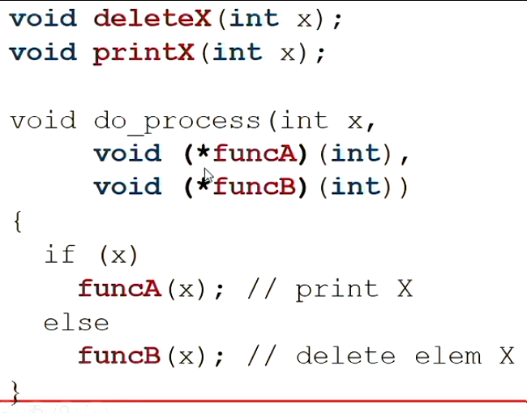
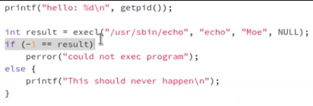

**COMP2017: Systems Programming** (C)

## 1.2 INFORMATION IS BITS + CONTEXT
*source file* the actual code
*source program* sequence of bits, organised in bytes
* text represented through ASCII standard, unique byte-size integer value --> text
* machine representations of numbers arent the same as real numbers, just approximations
* different data objects differ based on their context of viewing; same bytes could represent an integer, string, machine instruction, ...

## 1.2 Programs Are Translated by Other Programs into Different Forms
* code transformed into low-level machine-language instructions
* source program > pre-processor > compiler (translates file to contain assembly-language program) > assembler (becomes machine instructions) > linker (brings needed functions together, like printf.o w/ hello.o program) > execution of program

## 1.3 It Pays to Understand How Compilation Systems Work

* optimizing program performance: what functions are more efficient than others, whats the overhead, ...
* link-time errors: linker is the source of a lot of problems
* avoiding security holes: buffer overflow vulnerabilities, need to understand the consequences of the way data is handled and stored

---

# WEEK 1
## LECTURE
* python and java are *managed languages*
* C doesnt have garbage collector, no safety, no overhead
* programmer must understand the MEMORY model

* things are stored in memory, addresses and values
*address* the location in memory of the value `0x00A7`
*value* an arbitrary number of bits, first bit stored at the address
* subsequent addresses go up by bytes, (8 bits)
* have to explicit about how much information `32 bits`, `3gb`
	* how is the information encoded, a bit sequence to decipher

*how much memory do we have*
* address range
*where is a value we want to retrieve*
`int x = 0;
&x --> the starting memory address`

*where does a new value go*
* need to consider what space is available

*how can we refer to an area of memory for somewhere else*
* give them the address

* you can put memory addresses in a memory address :o
* using da camera: memory > main memory > system memory > bus h/w > microcontroller (CPU) > camera chip
* cascading copied, and copied back to verify

* memory relies on: correct values being copied, from and to the correct address, at the right time (e.g. local/global variables, different actors)
* heterogeneous compiling and whatnot because of different computer architectures

**history**
* 1970s, things in bytecode or assembly, problem of portability
* C provided another layer of abstraction that could run on multiple machines
* C doesnt have: objects and classes, templates, operator/function overloading
C contains:
* preprocessing language (text, macro language) 
	* for purely text based languages: taking in text, modifying, outputting text
	* definition of macros, include files, conditional compiling
* C language


`echo $?` return of the outcome (in int) of the last command
`cat <file.c>` print code
`gcc -o hello_binary <file.c>` runs it?

* explore all da possibilities
* buffer overflow: when a value exceeds the memory allocated to it
* you can only initialize variable once `int a =`, `a = `

**java vs c**
* C is a simple memory model, Java has 1 million+ classes, OOP
* C uses pointers, bit-level operators
	*bit-level operators* can extract the specific 0's and 1's you want of a byte, manipulation of memory at the bit level
* Arrays in C have contiguous regions in memory (array indexing using pointer indexing)

both:
* block structures
* control structures `if, else, while ...` the same
* primitive array --> looks like c (c has no .length)
* c: unsigned int vs signed int

**preprocessor**
* C macros `#define`
* Call-by-name
```c
int main (int argc, char **argv){}
int main (void)
void main (void)
```
* in C, you can only have the *main* which are unique
* C, you can use function names in other contexts?
* `unit_16t`, have to be upfront in declarations, of amount of memory
* C: conditional compilation (must use function callbacks in java, runtime class allocation)

```c
int a[5] = {7, -1, 3, 5, 2000}; //will create contiguous memory of the array, each bit the size of the integer
//when we use a, substitutes with the value of the memory address it points to. i.e. int 0x0030[5]; 
```

* last character of array is a null byte `\0`
* c strings are arrays of characters
* char is 8 bites, range of 256 values, null byte is 0

*sizeof* macro, used to query the size of a datatype --> returns int amount of bytes `sizeof int`
* cannot be used for dynamic memory

* previously, declarations only at block start, now
`for (int i = 0; i < n; i++)`
* C is only better than java in performance for low overheads, less memory


* statement is anything that has a semi column following it
```c
do <statement>
while (<expr>)
//
for(<init expr>; <boolean-exp>; <continuation-expr>) <statement>

for (x = 0; x < 100; x++)
	counter[x] = x;

return <optional expression>
break
continue 

switch(...)
{
	case <constant-expression>: <statement-sequence>; //has to be specific
	case ...: ...
	default: ...
}
```
* in the file: source code, functions, variables outside function
* function declarations not in it (information about the function)

* object file: binary file placeholder for a final binary file

* "" > for the user?
```c
#include "foo.h"
```

# WEEK 2
## TUTORIAL
* C is statically typed, variable has to have a type associated with it `int a = 2;`

>char and unsigned char
int and unsigned int
short and unsigned short
long and unsigned long
double
float

* unsigned types can be prepended to integer types
* arrays declared like


## TUTORIAL
* header file looks into user included?
`grep puts`
`cd -`
`man 3 puts` goes to the manual

```c
#include <stdio.h>
int main(int argc, char** argv){

	char* greeting = argv[1];


	return 0;
}
```
`**` nested pointer, `*` single pointer
* `fgetsc` one character from the file stream
* `fgets`, i just want to read a line, as an array of characters?
	* can fail if you put in more text than buffer
* `scanf`, i want to read the stdin buffer in a formatted way (can fail if buffer is not formatted well, your cursor can become in an unknown position)


* areas of memory, 3: .text (ax), .data (wa) (global), .bss (wa) (static)
* strings are stored in program code memory, only used for execution (read only) 
* so in the case of the array, the string literal is copied from program code into the stack frame at run time? actually dont know
* stack memory starts with high memory addresses and goes back


* Sizeof(array) /  sizeof(array[0]) is the same as Len(array) ?, cant do this with pointers


```c
int ** p = "...."
*p = p[0]
*(p + 10) = p[10]
*(p) + 10 = p[0] + 10
```


*dereferences* get the value associated with the memory pointed to?
`&r[20] = &*(r+20)=r+20`

```c

int** y = ... //its like a 2 dimensional array
int* x = ...

*y -> int* //will be like {1, 2, 3}
*x -> int //will be like 1
**y -> int //will be 1
can do y[0][1]

```


```c
&((r[5])[5])
*(r+5) + 5


(*(r+5)) + 5

```
# LECTURE 2
C simple types: float, int, char; each "implies an interpretation of the bit pattern stored in the memory"
* on declaration, reserve memory of the type (int automatically allocates int amount of memory, initializing fills in the bits where its located)

* arrays, printing before assigning values to an index is random data

`char stringName[] = "text";` will initialise an array of length 5, with null byte at the end
* printing string --> prints the bytes next to it until there is a null byte

doing: `char x[10]; | x = "hello"` doesnt work, it cant reallocate memory
* to refer to the address of an array, its just the array name

* remember! pointer point to a memory address
*address operator* & (can also be bitwise & operator)
*indirection operator* * (can also be multiplication)
* if it has * , it holds a memory address `int *ptr | ptr = &number`
* want to print * ptr, to get the actual thing, ptr prints the address
* size of pointer is dependant on 32/64bit (4bytes/8bytes)
* type declaration of pointer retrieves the length of its type (int will retrieve 8)

`int **tricky` a pointer called tricky, holds address of another pointer, that holds the address of an int
* dereferencing, unravelling the indirection through `*`
```c
char msg[] = "Hello!";
char *str = &msg[0];

//for H in memory, can be accessed by: msg[0], str[0], *str
// for E in memory, can be accessed by: msg[1], str[1], *(str+1)
```
* can also do this to arrays!
* `*p` is the first element of array p

*way to iterate through string*
```c
char *text = "hello!"
char *str = text;

while (*str)
	str++;
```


* pointers are essential when using dynamic data structures (not static!)


Interpretations of `int **data`;
1. Pointer to pointer to single int values					size [=1, =1] *where > is >=	
2. Array of addresses that point to a single int 			size [>1, =1]
3. Address that points to one array of int values			size [=1, >1]
4. Array of addresses that point to arrays of int values	size [>1, >1] 

* once a static variable is initialised, it cannot be reinitialised? its value is updated (its value is not forgotten?)

`*(argv + 1)` --> first argument as a C string
`*(*(argv + 4) + 1)` --> second character of 5th argument = `*(argv[4] + 1)`

```c
void *get_address(datatype *data, int n) {
	unsigned char *ptr = (unsigned char*) data;
			return (void*) (ptr + n);
}
```
* choose a different data type to change pointer arithmetic
`sizeof()` operator returns the number of bytes used to represent the given type/expression `sizeof(int) | sizeof(1)`, pointers will give back the memory address

* CHAR_MIN, CHAR_MAX
* *const* operator is fixed data, control behaviour of interfaces, non-writeable
* `char buffer[N]` -> `char ret = fgets(buffer, 7, fp);`
* fgets reserve last thing for null byte

```c
int main(){
	FILE *fp;
	fp = fopen("hello.c", "r");
	if (fp == NULL) {
		fprintf(stderr, "Failed...");
		return 1;
	}

	char buffer [7]
	char ret = fgets(buffer, 7, fp);
	if (ret == NULL) {
		fprintf(stderr, "Failed...");
		return 2;
	}
	int i;
	for (i = 0; i < 7; i ++){
		printf("%d %c\n", buffer[i], buffer[i]);
	}
	printf("%s\n", buffer); //fgets inserts a null byte

}
```


## 02 TUTORIAL

* create a temporary pointer for a sequence in a function, so you dont lose start of pointer
* strace
* local memory if within other functions, need to modify actual memory addresses to do otherwise
* push things out to stderr, like `fputs("...", stderr))`

* redirection for test ./ccode < test.in

`./code test1.in | diff - test1.out`

* -debug cool?
* char 0 == 48

```c
int main(){
	int a = 5;
	int* p = &a;
	void* ptr = p;

	int* b = (int*) ptr; // () is the cast
}
```

#WEEK 4 (STRUCTURES)
## LECTURE

```c
int count_chr(char *text, char target) {

	if (text == NULL) {
		return 0; //should have considered this
	}

	int count = 0;

	char *cptr = text; //refers to first character of text 
	while (*cptr != '\0') {

		// check if character is equal to target

		char ch = *cptr;
		if (ch == target)
			count++;

		cptr++; //moves the pointer down the string
	}

	return count;
}
```

*structures* aggregations, multiple datatypes embedded into one (like a class)
* its stored as an array, contiguous memory

use case: like a library catalogue that holds strings, ints, whatnot

```c
struct date
{
	enum day_name	day;
	int 			day_num;
	enum month_name	month;
	int 			year;
};

struct data v; //gotta refer to the struct
```
*singleton* like thing
```c
struct date
{ //definition
	enum day_name	day;
	int 			day_num;
	enum month_name	month;
	int 			year;
} Big_day { //declaration of variable of this type
	Mon, 7, Jan, 1980
}; //initialization

foo(){
	struct date 	moonlanding;
	//this requires 16 bytes, reserves 16 bytes! (with garbage values)
	struct date		deadline = {day_undef, 1, Jan, 2000}; //undefined if wrong amount of arguments
	//reserves 16 bytes!
	struct date 	*completion;
	//reserves 8 bytes (memory address) that would have garbage values?
}
``` 	

* structures dont have methods

```c
struct date bigday;
int 	the year;
theyear = bigday.year //dot operator, nominate an element of the structure
//does a pointer arithmetic, jumps to correct byte
```

* structs cant have variable sized content (its size needs to be known in compilation)
* putting in `int args[]` would assume it to be a pointer, allocating 8 bytes 

* can put in a struct into a struct?? (also recursively)

```c
struct date bigday;
struct date *mydate; //holds an address (pointer)
int 	theyear;
mydate = &bigday;

theyear = mydate->year; //is the equivalent of (*mydate).year
```

*typedef* can create synonyms
* kinda shouldnt use it, just aesthetics
```c
typedef struct date{
	data;
} Date;

Date Big_day;
```

* duplicates structs when parsing it into functions
* if your parsing a struct into a function, it only changes things locally
* pointers allow you to change memory instead of duplicating memory, returning things back,,

```c
struct customer 	s1;
struct salesrep 	s2;
struct sale transact(struct customer s1, struct salesrep s2);

struct sale transact(struct customer s1, struct salesrep
	s2)
{
	struct sale sl;
	...
	return sl;

}
```

* `const char *name` c string i think
* CPUs optimised to fill *words*, 32 bit machine its 4 bytes, 64 -> 8 bytes
* structs add padding if it doesnt it fill it up, a single char in a struct will fetch 4 bytes
	* can test by seeing how far different variables are from each other
	* can save space by rearranging fields
* can put in global scope?

**unions**
* several variant of a structure, doesnt consume more memory
* can overload the memory depending on what you call it with

```c
// books: author, ISBM
// films: director, producer

enum hoding_type{book, film};
struct catalogue
{
	char *title;
	enum holding_type type;
	union //this thing, switches  
	{
		struct/* book */
		{
			char *author;
			char *isbn;
		} book_info;
		struct /* film */
		{
			char * director;
			char * producer;
		} film_info;
	} info;
}
```
* modifying memory in a union may fuck things up 
* a switch statement with x.holding_type,, confirms which switcher it is
`printf("size: %uz\n", (void*)&(structName.valueA) - (void*)&(structName.valueB)` //recast it as a void pointer, perform pointer arithmetic

**bitfields**
* specify a size in bits, doesnt do padding

```c
struct IOdev
{
	unsigned R_W: 1;
	unsigned Dirn: 8;
	unsigned mode: 3;
	unsigned pad: 4;
};

struct IOdev dev = {1, 0, 7};

void main()
{
	printf("mode = %d\n", dev.mode);
}
```
* you gotta use bitwise operators to navigate (x>>15)
* `>>, <<, &, |, ^, ~`
```c
R_W = x>>15 //moves bit to the end
Dim = (x>>7);
Dim = (x>>7) & OxFF;
```

**files**
* files are an abstraction, through OS System Calls you can get things
* streams, source of data that continuously produces new data, its open ended
```c
FILE *fopen(const char *path, const char *mode);
File *myfile = fopen ("turtles.text", "w");
fclose();

ftell() //look at where you are relative to beginning of file
fseek() //jump around file

while ( ! feof(stdin)) {} //EOF check
```
* unbuffered, fully buffered, line buffered
* flush on buffered, stop everything on this buffering mode until we can confirm it has been written (on unbuffered, it stops it)

##TUTORIAL
* you can reinitialize a struct, unlike an array: through a function only
```c
struct person create person(const char *name, int age) {
	struct person p;
	strcpy(p.name, name);
	p.age = age;
	return p;
}
```
* fwrite buffers the data
* if program crashes, the buffer is gone (flushed)
`r[5][5] = *(*(r + 5) + 5) => &(r[5][5])= &(*(*(r + 5) + 5)) = *(r + 5) + 5?`
`A[I] == *(A + I)`
* fprintf() is printing like strings, while the others just output the binary data, the memory representation

# WEEK 05
## DYANMIC MEMORY MANAGEMENT
*memory* long array of 8 bit pieces called bytes, has a memory address
* different areas of memory: stack, heap, global/static, code

*stack* data structure that stores all information necessary for a function/method in runtime, local variables, function arguments, return addresses, temporary storage
*heap* dynamically allocated memory, decided by the programmer
*global/static* global variables (bad), and static variables (systems that dont change, like a string) [fixed]
*code* program instructions, exists and lives in a specific part of memory, machine binary instructions, compiled code [fixed?]


* heap memory has free space above it
* stack memory has free space below it

*stack* every singe variable local to a function and function args are called onto a stack!!, `push args onto stack -> push return address onto stack (where to go back to after function is finished) -> jump to function code`

* foo stores the address of what code to execute next, at which line: program counter

* stack pointer, increment it to add local variables, after code is executed, we pop local variables from the stack -> store the return address somewhere else, last element: push return result onto the stack

1. the argument pushed
2. the address is pushed
3. push local variables
4. pop everything
5. push return value onto first index
* during the compile time, all local variables are known, preallocation at the top

**heap**
* dynamically allocated, at run-time. 
1. make a request for memory (of a specific size):
	a. check if there is space
	b. otherwise, get back pointer of where the first byte of the allocated memory

* global if its before main
* if pointers are associated with heap memory, its stored in stack
* calling `static` before a function is a scoping rule?, only accessible in the file
	* it also persists forever in the static space

* if its static, it doesnt mean that it cant be changed, it just doesnt get forgotten (*state* persistent along function calls)

`strtok` take in a string, extract tokens based on a delimiter
* call it once, get only the first value ("x:y:z", ":"), subsequent calls increment value (NULL, ":")

`strtok_r` safe version!, you provide the saveptr as an argument (a char** )

* creating object `myObject name = new myObject();`, the name goes into the stack, the object goes into the heap
* in python/java, you can make objects without storing them into a variable, in C bad

**dynamic memory**
1. request allocation malloc() 
2. release allocation free()

* 1. makes a request to the c library, returns a `pointer to a void; void*`, must cast it

```c
#include <stdlib.h>
void *malloc(size_t size); //number of bytes to request, size_t is an unsigned amount of memory: you want to use this type, returns an address
//returns a non-zero address value if successful return, otherwise null pointer
//good for network/binary read and write


int *ptr; //on the stack
ptr = (int *)malloc(sizeof(int)*20); //how many bytes, 20* the size of how big the integer is (4 or 8)
//casting allows us to do ptr[0]
ptr[0] //to access this needs to cast
ptr[9]
```

**calloc**

```c
void *calloc(size_t num, size_t size);
//num: number of "blocks" of contiguous memory
//size: size of each block
```
* malloc just gets us a chunk of memory
* calloc allocate memory and initialize them to 0
* something about memset

```c
void free(void *ptr)
//ptr is the memory address we got from malloc() or calloc()
//needs to be the start, as it looks through libc

int * ptr = NULL;
ptr = (int *)malloc(sizeof(int)*20);
free((void *)ptr);
ptr = NULL; //it just makes the first address 0, rest is garbage/same,, should clear it
```

**realloc**
* need for dynamically allocate more memory
* create new memory area, copy old memory and remove old memory
```c
void *realloc(void *ptr, size_t size);
//*ptr -> original pointer
//size -> new size (can be smaller?)

int * ptr;
ptr = (int *)malloc(sizeof(int)*2);

ptr = (int *)
	realloc(ptr, sizeof(int)*20);
```

* remalloc sets the all the areas in memory previously allocated to null values

**memory allocation with structs**
```c
struct thing* ptr;
ptr = (struct thing *)malloc(sizeof(struct thing));
ptr->day = mon;
free((void*)ptr);
ptr = NULL;
```

**safety issues**
* deallocate non-required memory
* dont deallocate memory that hasnt been allocated --> e.g. double free
* can have a *wrapper function* to malloc, keep track if freed or not
* dont use memory that has been deallocated


* would wanna check if ptr is NULL

# LINKED LISTS

--> still to do


# WEEK 05
## LECTURE


* functions, value in memory
* the .AA are jumps
* -4(%rbp), moving into a register
* function calls require a jump to a different area of assembly (perhaps from an external library, ...) as "call"
	* push all parameters, set up local variables, return address, remove stack at end of function
	* stack is being managed


we have a reference to some area of memory

*function pointer* holds an address value that refers to an address of memory with executable code (m. first instruction of the function call)
* use cases: do something, then call this function
* if error, call function
* give a function to a data source to give updates?
* function pointer for a comparator to parse into a sorting function

```c
int foo(){}
int (*fptr)() = foo;
fptr();
```
* in assembly, it dereferences the address

```c
void fun(int a) {
	printf("input is: %d\n", a);
}

int main() {
	void (*fun_ptr)(int) = &fun; //or
	void (*fun_ptr)(int) = fun;
	fun_ptr(10); //"input is 10"
	return 0;
}

```


```c
void memcpy(void *dst, void *src, size_t size){
}

//declaration
void (*mcptr)(void *, void *, size_t) = memcpy;

//call
mcptr(buffer, src_buffer, 100);
```




**signals**
* hardware mechanism to handle I/O event where something is waiting: an action has to be stopped to handle a process (e.g. a keyboard interrupt)
* application level interruptions

*signal* allows a process to communicate with another

* save the state of the current function (save registers, stack/heap, Program Counter), jump to different function (signal handler) > when the function returns, execution continues with restored values

*kill signal* kill a process, the runtime library will instantiate the abortion of that library

```c
#include <stdio.h>
#include <signal.h>
#include <unistd.h>

//this asks compiler to not optimize this type 
volatile int interrupted = 0;

//signal handler
void impatient(int arg) 
{
	interrupted = 1;
}

int main()
{
	void (*variable)(int) = impatient;
	//c library event: if SIGINT (interrupted), call variable

	signal(SIGINT, variable);
	//this sets up the signal for later
	//same as signal(SIGINT, impatient), function pointers to change behaviour during runtime

	//infinitely running task
	while(!interrupted)
		usleep(10);

	printf("program terminated")
	return 0;
}
```

* `ctrl+c` sends a SIGINT from shell to the binary, which will call the function

```bash
$ kill -9 <process id>
$ s -A | grep a.out
--> 18013 a.out

$ kill -9 18013


$ kill -s SIGKILL <process id>
$ kill -s SIGSFGV 18013
#induces a segmentation fault 
```


* want these signals to be caught and handled

`int kill (pid_t pid, int sig);`

*catching signals*
`sighandler_t signal(int signum, sighandler_t handler);`
* `sighandler_t` is a typedef of `typedef void(*sighandler_t)(int);`

**errno**
* global variable, typically positive integer, that has a number based on last reported error
* can only store one number at a time, can override subsequent errors
* `strerror` stringified version of error
* `perror` gives the current string of the current error of the program

```c
#include <errno.h> //extern int errno
#include <stdio.h>

int main() {
	FILE *fp = fopen("doesnt exist", "r");
	printf("errno: %d\n", errno);
	return 0;
}
```
* way of handling: set errno to 0 before important function
* use `perror("");` to see error after each operation, setting error to 0 before

**low level file i/o**
* high level: things are buffered for you, you can access character array
* pointer to FILE struct is filled in by C library

*file descriptor* ???
* 0 stdin, 1 stdout, 2 stderr
* system call functions operate on file descriptors

`creat`, `open`, `close`
`read`, `write`

controlling device dependant activities:
`ioctl` communicate device driver, have a custom implementation for reading/writing
* variable argument

`umask` permissions of who can access the resource


```c
errno = 0;
//read 100char from stdin into array "buffer"
ssize_t result = read(0, buffer, 100);
//file descriptor (0: stdin), array of characters, number of bytes
if (result < 0)
	error_val = errno;
if (EINTR = error_val) //EINTR (interrupt) reattempt
```
* accessing the man page is important


* signal handlers need to be small to prevent multiple signal handlers interrupting at the same time (e.g. changing one variable)


**catching signals**
`sigaction()` works on every platform
```c
#include <signal.h>
int sigaction(int signum, const struct sigaction *act, struct sigaction, *oldact);
//signal number, signal action to perform, memory address for where to store old signal handler function address

//the void ones are function pointers
struct sigaction {
	void		(*sa_handler)(int)
	void		(*sa_sigaction)(int,siginfo_t *, void *)
	sigset_t		sa_mask;
	int 		sa_flags;
	void 		(*sa_restorer)(void);

};

//ex
sigaction(SIGINT, &new_sig_int, NULL);
```


**linked list**
```c
struct node {
	int value; //void * data
	struct node *next;
}

//new function pointer type, init
typedef struct node * (*list_add_f)(struct node *head, struct node *n);


struct node *list_append(struct node *head, struct node *n);
void list_free(struct node *head);
void pfree(void *address);
void print_list(struct node *head);


//helper function
struct node *node_create(int value){
	struct node *n = (struct node)malloc(sizeof(struct node));
	n->value = value;
	n->next = NULL;
	return n;
}

//head of the list, what to insert
struct node *list_append(struct node *head, struct node *n){

	//case with 0
	if (head == NULL)
		return n;

	struct node *cursor = head;
	while (cursor->next != NULL)
		cursor = cursor->next;

	//when next is null, add then new element
	cursor->next = n;
	return head;
}

//head, need to make a -> next = b
struct node* head;
while (head != NULL){
	printf("%d", head.value);
	head = head->next;
}

//freeing memory, need to navigate to next before disposing current
void list_free(struct node *head)
{
	if (head == NULL)
		return;

	struct node *cursor = head;

	//one case
	if (cursor->next == NULL){
		pfree(head)
		return;
	}

	struct node *temp;
	while (cursor != NULL) {
		temp = cursor -> next;
		pfree(cursor);
	} //?
}

void pfree(int* address){
	struct node *tmp = (struct node*)address;

	free(address)
}

//turn arr -> linked list
struct node *create_list(int count, int *values, list_add_f fn_ptr) { //last one is function pointer: allows you to append or prepend

	if (count <= 0 || values == NULL || fn_ptr == NULL){
		return NULL;
	}

	struct node *head = node_create(values[0])

	for (int i = 0; i < count; i++){
		head = fn_ptr(head, node_create(values[i]);
	}
}

//making it
int main() {
	struct node *head;
	head = node_create(69)
	head = list_append(head, node_create(420));

}
```

# WEEK 07


**The C Preprocessor**
* compilation pipeline, source code (human readable) -> compiler (preproccessor -> assembler -> linker) -> binary file executable
* each step can be *introspected*, you can get the file from that step

`gcc -E file.c` gives you the transformed preprocessor step
`gcc -S file.c` assembler output (assembly instructions), in file.s
* has c strings and shit, without addresses: shows us different sections and variables only
`gcc -S -g file.c` more things!

`gcc -c file.c` object file in file.o in binary; can use `obj dump -s`
* operations in .eh_frame, and also has values

* linker program will combine object files with any additional symbols need to make a binary file
* creates an object file that has functions and variables and their position in memory
* need links to library file libc.so for print
* performs a *symbol resolution* processes, linking symbols together across object files2

*object code files* has objects, and addresses (a symbol?)
* for external functions, it doesnt have the address, and needs to link with the library file? [libc.so] to get it (through the header file?)

*header files* tell us what functions exit and their function prototype

*binary exec*
* places all the object files in order of memory
* does 1 object file, then adds the next with the offset of the last size

---


# WEEK 07 PROCESSES

* parallelism, occurring! describing the state and execution of a currently running program

*process* collection of data, instructions, and state to run a computer program

* OS requires a process: available memory, what has been used, program counter, what code ... (needed! additional software to manage this, a *necessary abstraction* to mediate between program -> hardware devices)
* OS gotta make program runs; needs a way to create new programs and run them in parallel (from one process)

OS processes:
* manage all the memory for all the processes, devices (e.g. multiple usb devices)
* do search tasks, (e.g. moving mouse around, having to render that and the program behind it, and the interactable elements of the program)
* OS needs memory to manage this


* gotta access hard ware, files
* in stack, variable -> refers to someone in heap, static, instructions in static -> code
* code like fopen() --> libc in static --> (new section) kernel space

*kernel space* copy of the operating systems management data, and what the OS is doing (e.g. address of a stdout device)
* when the program starts, the OS adds the program to the kernel space, becoming the *process*

when program is run, information about:
*process identifier* unique associated number
*parent process*


*kernel* restricted access memory, may have read only (audio stream) or write access
* *system calls* to access kernel

*virtual memory range* its what the process runs in!


* the OS will only load what is being used at a moment into physical memory, other things go to disk, need to do *address translation*

**initialling processes**
* 1 process, from turning on
* system call, to create a new process (need permission)
* new process!
	* the shell can make new processes :o

`int main(int argc, char *argv[], char *envp[])`
* `envp[]` is the environment variables!
* printing this out gets you a bunch of details!

bash: create echo --> echo process: stack; argc[2], argv[\*]; static[argv]; code

**initialling process**
* calls execl
```c
int execl(const char *path, const char *arg, const char *arg, ..., (char *)0);
```
* path -> the binary file, copying it into code area of memory
* whatever stack existed before is replaced by another program (switches it)


* should never execute because it is replaced by echo program code

> exec: replaces user space

program A (id = 355)
--> execl(./B, 0)
program B (id = 355)

* it jumps to a completely different part of the program and cant go back!
* with a `fork` you can still continue to execute things, cloning the process

if execl is not successful it, evaluation of the expression happens after it --> result is never set if its successful; everything is gone!
--> if its unsuccessful, it returns -1 (we have the resources, need to deallocate memory)

`pid_t fork()` clone a child process that is a copy of the memory image of the parent
* the process identifier (pid) is different
* the copy is the child, which has the id changed
* returns: 0, child process, uint, child number, -1 failed
`get_pid()`, `get_ppid()` parent process id

* both programs will run in parallel (but actually the process scheduler runs in a specific order)
* the program counter is different between them
* we dont know what the OS is going to do, there are two possible outcomes


* the sleep enforces some consistency?

**fork + exec!**
* clone (fork), replace (exec)
* the parent process can continue executing its own program

`pid_t wait(int *status)`
* blocking function; can wait for the child process to finish
`pid_t waitpid()`
* for multiple children

**shell**
* a process that can spawn other processes and ask them to do other things
* the `wait` operation is fork->exec

* enter command (a string), 1: `echo` 2: `hello world`
1.
	* we need to convert: (can attach new string, or search path, to find in `envp`)
	echo -> /usr/bin/echo
	grep -> /usr/bin/grep
`envp $path` ?

2. 
*strsep* separate a string into tokens
echo hello world -> "usr/bin/echo" "hello" "world"

*strdup* makes a copy of the string

3.
* create a copy of all of the data
* call `shell fork()`, `execl(args[], NULL)`
* `result_of_child_process = wait(&status);`

`$ cowsay hello`

typical flow: you are the child, do something, while parent continues

# WEEK 08
*process* data + instruction
*exec* replaces memory image of a process with a new program
*fork* duplicates a memory image
* combination can make a program with multiple processes
* program: multiple processes
* process: to run a program

*wait* get the parent for a(ny) child to complete; synchronisation mechanism (start -> end of child process)

* signals allow you to do synchronisation, can send an integer
* lost signals: if we are in the signal handler while processing one, we can lose it
	* multiple signals, signal protocol: sent -> reply, dunno

*synchronous* a->b, b->a, like a phone call
*asynchronous* usb -> interrupt -> reaction, inserting a usb device

**file descriptors**
* file is a stream of data
* managed operations: `fopen` `fseek` `fread` `fclose`
* instead of having an opaque `FILE *`, we have:
*file descriptor*, integer: 0 stdin, 1 stdout, 2, stderr
`read(0, buffer, 100)`

> "man 2 <name>" for system man pages

*pipe* communicate between two processes
* push data from processes, put it in kernel buffer, read it in another process (as a queue, unidirectional)

* avoids problem of signal, can send more data

1. ask for a pipe
2. kernel sets up pipe, returns file descriptor for read, file descriptor for write
3. can read and write to pipe

```c
int pipe(int filedes[2])
//return 0 on success, -1 failure
//(memory address) to store two element array of integers 
```


* creating back and forth comms: need  to make 2 pipes, 4 file descriptors (need to share information)

kernel pipe implements a *circular/ring buffer*
* sync is enforced when you have `read`, it doesnt keep processing until it has read `x` bytes from respective `write` of other process (blocking operation)
* you can close the pipe ends that arent needed with `close(fd[n])`
* can make new pipes from subchannel to communicate separately between processes, as many you like

* if you fork, create a pipe then fork, you can access the pipe from the child of the child

* generally, when you create a pipe and fork, all children can read (want to create n pipes for n children ideally)


`select()` monitors file descriptors for events
* asynchronous, unlike read and write which are blocking
* what if input is too large for stack? what if reading is too slow to keep up?

* macros used to define the set of file descriptors, using a macro *bit vector* `00010000` where the 1 is the important one,
`FD_ZERO() FD_SET() FD_CLR() FD_ISSET()`
```c
int select(int nfds, fd_set *readfds, fd_set *writefds, fd_set *exceptfds, struct timeval *timeout);
//nfds: max(fd) + 1 [e.g. 1,3,6 -> 7]
//time val to move on if things arent responding
```
* blocking IO synchronous sharing of data (sending things back) (but blocking)
* with pipe, can still send data back with this (but can be queued in a pipe)

```c
open("bigfile.bin", O_NONBLOCK | O_RDONLY);
fcntl(fd, F_SETFL, fcntl(fd, F_GETFL) | O_NONBLOCK)

```

* child and parent have to both close the file descriptors of the pipe

> timeval is a struct
timeout.tv_sec = amount of seconds

* pipe() creates 2 file descriptors, as you put in pipe(array of 2 int)
* the pipe can read from stdin [0], stdout, stderr ==> automatically created for every process
* non blocking operations need to look at flags to see if input been made

--> nb_select_pipe is where child can keep doing things after sending

#WEEK 9 THREADS
* communicate between two programs at same time (with independent, duplicated memory); IPC: signals, pipes, shared memory
*parallel* same thing happening between two processes
*concurrency* multiple processes working together (like table tennis)

*threads* parallelism (as opposed to sequentially) using the same memory image
* threads with a unique program counter
* tasks have *dependencies*

*task parallelism* different tasks performed by different processes


*data parallelism* the same task, performed in equal parts by different processes 

> `T1 || T2` means t1 is parallel to t2
> do (datapar with a, b, c...)
> `Ta -> Tb` dependency notation

* the cost of communication between tasks can exceed parallel speedup 

*task* specific activity within a program that is a sequence of instructions

*implicit parallelism* when the compiler detects separate tasks

*explicit parallelism* done by the programmer


* thread contents live in stack/static
* thread struct: program counter, unique stack, with functions, registers

* one thread per process


* writing to same file with multiple threads, need a way to preallocate file size

`pthread_create(&pthread_struct, NULL, function pointer to start with, return value)`
* continuation is independent (but there is thread safety, i.e. print prints out the whole thing before doing the action of the other process)
`pthread_join(my_tread, NULL)` (blocking, like wait())
* sync mechanism; will block the calling thread, when the thread ends, will unblock

* once you create something, it will go to its function
* the main thread continues

*execution indeterminism* when no assumption about statement execution is possible


* thread is in the stack 

* all threads are on the same level, run when they want to


* you create an array of arguments, filled with numbers, where we can associate work that relates to such a number for a thread (need to have it in an array!, rather than the same area of memory that increments)

*race condition* due to the indeterminism of thread running order, a situation where you get a different output based on relative timing of thread execution
* read operations are fine, but `when you add a write operation, it could get fucked up`


*thread termination*
* finished the function (start routine)
* thread calls `pthread_exit()`
* a thread can be cancelled by another thread
 
* when a thread has terminated, the stack goes away (apart from malloc!! this can cause memory leaks, as well as opening files/pipes)
 
* calling `exit()` in the main thread kills everything!
* `pthread_exit( (void *) [num<4b] )` concept

**mutex**
* mutual exclusion device; change from parallel execution to serial execution for a set of instructions
1. define the beginning and end of a code
2. allow one thread to execute it, others are blocked if it tries to do it

* having multiple threads increasing the same number can have an issue, because you gotta read -> compute -> write, and in that time other things can happen in other threads

* mutex can prevent this! we guard access
`pthread_mutex_t` lock = `PTHREAD_MUTEX_INITIALZER`

`pthread_mutex_lock(&lock)`
`pthread_mutex_unlock(&lock)`
* only one thread can access the code, the other thread performs a blocking operation 
* every time you lock gotta unlock later (or deadlock)

---

W11 -> THREADS, lock contention
processes: breaking up tasks, getting an insight into the OS and shell
high performant code, write efficient alg, can i break up the tasks into smaller tasks that each individual CPU can process (constant speed)

#WEEK 10

* we want to serial the access to certain segments to prevent race-conditions from happening [otherwise we can parallelise, when the data cant corrupt]
`i++` -> read i, write to register, write incremental value -> write back to i

```c
pthread_mutex_t counter_lock = PTHREAD_MUTEX_INITIALIZER; // declared in static space
	
void * thread_function(void * arg) { 
	pthread_mutex_lock(&counter_lock);
	//critical section,  at most one thread
	pthread_mutex_unlock(&counter_lock);
}
```
* forcing things to wait doesnt allow speedup ):

`pthread_mutuxe_trulock(&mylock)`
* if non 0, then we could do other things

* only a thread that unlocks a mutex can unlock it

* dynamic creation of mutexes, to be able to define locks for a specific thing
* call `pthread_mutuex_init` if you malloc it 


```c
struct Node {
	pthread_mutex_t node_lock //mutex to lock, actually kinda big // or you could have a pointer to it
	int counter; //data in the list node
	struct Node * next; //pointer to the next node
}
```


* minimising the critical section

#!one writable resource, then it needs protected

* 2 or more shared sources, we can reach *deadlock* if we cant get all the resources we need

*self deadlock* cant lock the same thing twice, get blocked
*ABBA deadlock* when two threads need both resources, but each get one of each
* always acquire things in the same order: such that A->B is required
* just needs to be in any order A->B->C , A->C good (subset needs to remain in same order)
* perhaps you can release if you cant get 2

**conditions for a deadlock**
1. mutual exclusion (only one thread can access one)
2. hold and wait (needs to release if it cant get something)
3. no pre-emption (no one tells the process to give up a resource)
4. circular wait (like abba deadlock)

pthread_mutex_t m[MAX]
locked - held, not on the table

* when max = 2, or when everyone has a left chopstick
* deadlock when all first pickups are exclusive
* when one isnt exclusive (person 5 uses 0 index chopstick first), then no deadlock

* can create variable to see if you can hold the resource to actively release the lock

*starvation* the thread is never able to acquire both resources, imbalance of executing different tasks over the threads
* the order of unlocking is unimportant

---
*locking granularity* the amount of data that a lock protects
*course grain lock* consider the entire structure as writable by one thread (serialized)
* when user wants to each, user locks entire table
* when everything needs to be stopped (database that pushes something onto disk)


* in this, we only have to lock the node.next

*medium grain, fine grain* locking and unlocking has an overhead (more threads != better always)

* traversing through the linked list, we lock a node, then check if we need it, then release it 
* this guarantees the link hasnt been modified during the code running phase (e.g. node.next changes)


# WEEK 11 SEMAPHORE
*semaphore* synchronization variables
operations:
`P(s)`, `V(s)`
```c
while (s == 0) wait(); //thread has to wait, then s is decremented and it continue
s--;

s++;
```
* these are atomic operations (cant be split, no interleaving)

```c
int main () {
	pthread_t thr[MAX];
	sem_t s;

	int i, j;
	sem_init(&s, 0, 1); //last val invalid? no loc being held

	...
 
	sem_wait(&s)
	sem_post(&s)
}

```
* works to increment/decrement the allowed thread
* thread has to wait until the value of s is greater than 0
* for chopsticks problem, you want to limit people to 4
, as well as having the chopsticks be blocking


 this allows us to use semaphores as a signalling method
* semaphores to describe transitions 

* locks arent that scalable, isnt that cohesive


*livelock* you cant have everyone giving up all your resources, locking and unlocking at the same time without progression

*starvation* one thread is never allowed into the critical section, need fairness-property to prevent starvation

* for loops and shit can be executed in parallel
* limit is sequential part (Amdahl's law)
* SIMD, you can load different data in parallel and do type of ac

**recursion**
* if the recursion never reaches base, bad, needs to always be moving to the base case
* a recursive solution will always run more slowly than an iterative one because of the overhead
*tail recursion* unrolls things better, rather than having a different stack for everything

merge sort:
```c
void MergeSort(float A[], int p, int r){
	int q; //p and r dictate which part to be sorted
	if(p < r) { //if this is more than 1 elem
		q = (p+r)/2;
		MergeSort(A, p, q);
		MergeSort(A, q+1, r);
		Merge(A, p, q, r);
	}
}
```


*naive solution* create thread if you go through a divide step (would require an infinite number of threads :O)
*fixed parallelism* create a maximum limit, counter that contains the max. quite scuffed

```c

int main(){
	int active_threads = 0;
	int max_threads = 3;
	problem(max_threads, &active_threads);
}

void problem (int max_threads, int *active_threads){
	if(active_threads < max_threads){
		pthread_create ...
		*active_threads++;
		//may need blocking
	}
}

```

*scalable parallelism* prevent threads waiting 
* there is a limit, based on how many folds it has  
* to pass values for thread to execute, we build a struct and pass it in as a void *


* we need to then recall it in a separate function, to build the function to call again (or just write the recursive function better)

* sequential summation (cringe)

*reduction operation* reduces a collection of data items to a single data item by repeatedly combining the data items pairwise with a binary operator
* pairwise summation (epic), you add things like divide and conquer, binary tree like [because addition is associative]

* find sum, product, max, min, second smallest (have to visit the tree), k-way (k different value ranges, want to find the frequency of them) histogram, 

* index of first occurrence of x

split, find, have index; 
perform on left `solve(A, 0, n/2)`and right `solve(A, n/2, n)`
return left if it has it
return right if it has it
* needs an order?


* why cant i just have N processors, and then give len/N elems to loop through or something 

**Schwartz alg for + reduction**

these threads are competing for the sum value, must lock it n times (and make the merging serialized)

* hierarchically build a global value, by combining two things, then 4 things, ...
* store intermediate value in %2 indices, then %4 ...
*barrier* all threads that reach a line of code until every thread is there

---

* what happens when we dont have enough threads to split things nicely? e.g. binary combines on 1000 things with 4 processors
should be natural to make a linked list


`misc notes`

#2017.C
C.NOTES.md

##Style Guide
* use snake_case
* intialise variables one at a time, to a default value (0, NULL)
* pointers: `int* i = NULL;`
* constants, enumerators should be in UPPER_SNAKE_CASE
* soft tabs

```c
%c //character
%d //signed integer
%f //float
%s //string
%x //hexadecimal
%p //pointer, the address of a pointer
%ld //long
\n // new line
```
---

*where is a value we want to retrive*
`int x = 0;
&x --> the starting memory adress`

**main function**
```java
#include <stdio.h> //preprocesser directive, bring in the text stored in stdio.h file?

int main (int argc, char **argv)
//int is for reporting sucsess of failure, 0 reserved for sucsess
//there can only be one main function, is global
//first parameter: how many arguments, takes in three C strings
//argv: memory address of first of consecuative values of adresses of strings, jumpts between them 

{
	printf("Hello World!\n"); //printf is made known in the compiling stage, from the first line,
	return 0;
}

```

**input**
```c
int main(int argc, char **argv)
{
	int ftemp; //creates a space for ftemp in the stack memory (4 bytes)


	int ret = printf("provide temp");
	if(ret > 0){ //error handling, number of characters printed
	scanf("%d", &ftemp); //scanf also resolves to an integer return, based on how many things have been sent
	//first arg: format, i want to read a decimal, 1 integer
	//second arg: places it in the ftemp address
	printf("%d fahrenheight is %d centigrade", ftemp, (ftemp - 32) * 5 / 9)
	return 0;
	}
	return -1;
}
```


**pointers**
```c
int * pointer;
pointer = a;
//if we follow the adress, we are pointing to the area of memory of A
pointer = a + 3; //= the adress + 3 * size of the integer (prolly 4 bytes)
//
pointer += 1;
//moves it 1 integer in memory forward
```
`pointerName --> address
*pointerName --> value
pointerName[0] --> value`


dereferencing with * : address -> value
defeferencing with []: 
referenceing with &: value -> adress

**extern**
```c
int foo(float f1, char c2) //can only say foo once
{
	int x = 0;
	return x;
}

//new file

extern int foo(float, char); //taking from another file, at the end of the comp stage will check if it doesnt exist // can you for variables
```

**printing**
```c
int getchar(void); //get a single character from standard input
//uses int to give error return types, with 4 bytes?

void putchar(int c)

printf( const char *format, ...) // has C string, " text modifiers"???

print("%d %f\n", 10, 1.5);
```

**scanning**
```c

int x;
float f;
scanf("%d %f", &x, &f); //parameters must be pointers, not values
```

*puts*
```c
int main
{
	puts("text");
	return 0
}
```

**arrays**
```c
int array_1[10];
int array_2[] = { 1, 2, 3, 4};
int array_3[5] = {1, 2, 3}; //still 5 elements, but dont use it
```

**command line arguments**
```c
#include <stdio.h>

int main( int argc, char *argv[] )  {

   if( argc == 2 ) {
      printf("The argument supplied is %s\n", argv[1]);
   }
   else if( argc > 2 ) {
      printf("Too many arguments supplied.\n");
   }
   else {
      printf("One argument expected.\n");
   }
}
```

**fgets**
```c
#include <stdio.h>

int main () {
   FILE *fp;
   char str[60];

   /* opening file for reading */
   fp = fopen("file.txt" , "r");
   if(fp == NULL) {
      perror("Error opening file");
      return(-1);
   }
   if( fgets (str, 60, fp)!=NULL ) {
      /* writing content to stdout */
      puts(str);
   }
   fclose(fp);
   
   return(0);
}
```

**redirection with fgets**
```c
#include <stdio.h>

#define BUFFERSIZE 100

int main (int argc, char *argv[])
{
    char buffer[BUFFERSIZE];
    fgets(buffer, BUFFERSIZE , stdin);
    printf("Read: %s", buffer);
    return 0;
}
```

* if it reaches buffer size, next line will continue from that line

Melbourne::Sydney::14:13:12
Sydney::Melbourne::22:32:21
Melbourne::Sydney::16:55:12
Coffs Harbour::Morisset::20:46:14
Coffs Harbour::Koolewong::19:43:40


**attempt when i was trying to get big line**
```c
int timetable_reader(){
    char t[10];

    while(fgets(t, 15, stdin)){
        printf("name> <%s>\n", t);
        
        int sl = string_length(t);
        printf("strlen> %d\n", sl);
        
        printf("<%c> , <%c> !\n\n", t[sl-1], t[sl]);
        
    }
    puts("!END OF TIMETABLE PARSING!");
    return 0;
}
```


**struct**
```c
#include <stdio.h>
#include <string.h>

struct item {
  char barcode[6];
  const char *name;
  float price;  
};

// memory input
// given an array of structs

// idiom
// sum all prices
float items_sum( struct item *items, int n )
{
  float sum = 0;
  
  int i = 0;
  for ( ; i < n; ++i) {
    sum += items[i].price;
  }
  return sum;
}

struct item {
  char barcode[6];
  const char *name;
  float price;  
};

int main()
{
  // create array
  struct item items[2];

  // initialise elements
  // man strncpy - see warning
  strncpy(items[0].barcode, "DFH291", 6); //copies 2nd arg adress to first arg, of N charactesr being the last arg 
  items[0].name = "Big tuna"; //big tuna is stored in the binary file :o
  items[0].price = 1.25;
  
  //  init each field (man strncpy)
  strncpy(items[1].barcode, "FGD135", 6);
  items[1].name = "Tin can";
  items[1].price = 3.50;
  

  float sum = items_sum(items, 2);
  printf("sum: %.2f\n", sum);
  
  return 0;
}
```

* parsing an array in C, you should define a boundry with it: the size or the length of it `foo name(char *ch, int n)`
* `timeval`, `struct timeval start;`


---

#2017.OVERIQ

* preprocessor directives, accepts header files `.h`
* can do multi line comments with `/* */`
* entites are the generic name for things; identifers used to name them

`four types` int, char, float, double
* float (6d precision) and double (14d precision) store floating point numbers
`size qualifiers` short, long (long double - 10 bytes, short int, 2 bytes)
`sign qualifiers` signed, unsigned
* constant/literal, doesnt change (as opposed to a variable) 

`octal constant` starts with 0, between 0 and 7
`hex` 0x
(you can append l, u to the number to specify type)

can mix for some reason, i.e. `int i = 12 + 045 + 0x3a`
doesnt change how its stored internally
* MANTISSA e EXPONENT
* gotta enclose character constants with '', "" is a string
* char in C are small intergers converted in ASCCI, A = 65

*symbolic constant* `define NAME VALUE`

**operator precedence**
* brackets, dot/arrow operators, postfix increment/decrement (x++) most important [left to right]
* type cast, prefix increment/decrement (++x), indirection/address operator, unary operators (+, -, !) [right to left]
* then dmas
*prefix* : y = ++x --> y = x+1, x = x+1
*postfix*: y = x++ --> y = x, x = x+1


*Conversion Specification*
c:		Character
d/i:	Signed decimal integer
e/E: 	Scientific notation (mantissa/exponent)
f:		Decimal floating point
g:		Uses the shorter of %e or %f
G:		Uses the shorter of %E or %f
o:		Signed octal
s:		String of characters
u:		Unsigned decimal integer
x:		Unsigned hexadecimal integer
X:		Unsigned hexadecimal integer (CAPS)
p:		Pointer address
n:		Nothing printed
%:		Character	

`scanf("Control String", address 1, ...)`
`scanf("%d%d", &x, &y);`, two integer values seperate by a space
`scanf("%d:%d", &x, &y);`, two integer values seperate by a colon
* input goes into temporary memory called *input buffer*
* keeps storing of correct type until exit character (e.g. \n), pushing it to the back of the buffer

```c
scanf("%d", &n);
scanf(" %c", &ch); //preceding white-space prevents this being skipped as buffer has /n

scanf("%d", &n);
fflush(stdin);
scanf("%c", &ch);
```
* `getchar()` and `putchar()` do char i/o

**formatted input and output in C**
`scanf("%2d%3d, &a, &b");`
* a has width of 2, b of 3
* `4 34` -> a = 4, b = 34
* `23 456` -> a = 23, b = 456
* `234 99` -> a = 23, b = 4

* for `printf(%Nd)`, N pads the digits if the input is less than N
* for floating point values, it includes all characters (including the .) in counting
* `%w.ns` strings: w, width of the string, n = amount of characters displayed, .`.` adds leading spaces

...


**malloc**
`p = (datatype *)malloc(size_t size);`
* size_t is an unsigned int
* size is for the amount of storage
* returns a pointer to the first allocated byte of memory
* malloc is a void pointer, we need to cast it as 

```c
int *p; // p is pointer to int or (int*)
p = (int*)malloc(5*sizeof(int)); // allocate sufficient memory for 5 integers

if(p == NULL)
{
    printf("Memory allocation failed");
    exit(1); // exit the program
}
```

**pointers**
```c
int *ptr = NULL; //good practice
type **pp = &(*p); //woah double pointer
```
* indirection operator is applied right to left
* you can add pointers
`**pp -> *(*pp) -> *p -> value of p`

**arrays**
* `my_arr` and `&my_arr[0]` point to the same address, with base type int
* the base pointer (my_arr) is constant, so you cant do `++`, `--`, or assign it to another address

**2D arrays**
* normal pointer points to one element of an array
* can create *pointer to an array*, that points to whole array
```c
int (*p)[10]; //p is a pointer that can point to an array of 10 integers
*p; //the base address of the array it points to (after you assign it)
p++; //will increment by 10*size_of(int)

int *p[10]; //p is an array of 10 integer pointers

 //if arr is a pointer to an array
*(arr); //value of the ith 1d array
*(arr + i) + j; // jth address of the ith 1-D array
*(*(arr + 1) + j); // value of the j of the ith 1-D array

//to point to:
my_arr[2][3];
(*my_pointer)[3] = my_arr; 

```
**call by reference**
*call by value* copy each of the arguments in a function
* put in pointers, it has the actual addresses
`int function_name(int *a, int *b)`

* dont return a pointer to a local pointer!!!

**pointer array**
`datatype *array_name[size]`
get the value of a single one, `*arrop[i]`

`int *arrop[10] -> int *(arrop[10])`

**void pointer**
* a void pointer can point to any data type!
* before you dereference you must typecast

```c
int i = 10;
void *vp;
vp = &i;
printf("%d", *(int *)vp);
```

**unions**
* struct: each member has its own memory
* union: members share the same memory, initialised wit hthe size of the largest member
```c
union data
{
    int var1;
    double var2;
    char var3;
};

union data j = {10}; //this will j->var1 = 10, others are garbage
union data j = {.var2 = 9.14 }; // j->var2 = 9.14, others are garbage

```

---
# CS50
Pointers: An address 
	Passed all data by value, passing copies that dont change the original
	Pointers allow us to change the actual variable
	The manipulation of data can only happen in memory (RAM)

Always set the pointer to NULL; type* ptr = NULL, can do == NULL to check for null pointer 
& arr[i] address of the ith element of arr

	as part of the type name and   dereference operation

	dynamically allocated memory comes from Heap (things without names) not Stack (variables, things with names)

array of floats on heap
float* heap_array = malloc(x * sizeof(float));

---

https://blog.holbertonschool.com/hack-the-virtual-memory-malloc-the-heap-the-program-break/

malloc uses `brk` syscall to manipulate the heap, it calls it twice
1. sees where program break is
2. allocate from program break --> some amount

program break: address of first location after the current end of data region in memory (heap?)

`brk` sets the location of the program break (the end) to its argument (if it is able to)
`sbrk` increments program break by the argument amount
brk(0), sbrk(0) --> return current address of the program break

* malloc first creates an arbitrary large space, and uses chunks of memory from that rather than calling brk every time 

```c silly function that constantly calls
void *malloc(size_t size)
{
    void *previous_break;

    previous_break = sbrk(size);
    //shouldnt this be sbrk(0)

    /* check for error */
    if (previous_break == (void *) -1)
    {
        /* on error malloc returns NULL */
        return (NULL);
    }
    return (previous_break);
}
```

malloc stores in first 0x10 bytes, from 0x09->0x10: the size of the chunk of memory asked to malloc + 0x10 + 1
* it store each seperately for each chunk
in bytes 0x00 -> 0x08, it stores size of previous chunk
0x08 stores if the previous chunk is used or not

---

#2017.TUT

```c
int main() {

	int n = 5;
	puts("gonna fork!");
	pid_t pid = fork(); //creates new rpocess!

	if(pid < 0) {
		perror("Unable to fork!");
		return 1;
	}

	//child
	if(pid == 0) {
		puts("im child");
		n+=5;
		printf("%d\n", n);
		getchar(); //stops it

	} else {
	//parent: parent knows what the process id of the child is
		puts("im parent");
		n+=2;
		printf("%d\n", n);
		getchar(); //stops it
	}

	return 0;
}
```

going to fork -> i am parent (7) -> i am child (10)
up to process scheduler if 1 is going to get executed

if no getchar() for child process: it child process end without being cleaned up

processes: share memory until something needs to write to memory, then makes a copy (or is "volitle")
> we can treat them as separate segments of memory

waitpid() -> give me status of child process, if its finished, clean it up, else, get infomation

---
process sceduale: runs processes one after the other really quickly if it isnt sleeping


//execlp, execvp use the PATH VARIABLE

```c
int main() {


	pid_t pid = fork(); //creates new rpocess!

	if(pid < 0) {
		perror("Unable to fork!");
		return 1;
	}

	//child
	if(pid == 0) {
		if(execlp("cat", "cat", "filename.c", NULL) == -1){
			perror("exec failed ):");
			return 1;
		}

	} else {
	//parent
		wait(NULL);
		getchar();
	}

	return 0;
}
```

prints out the file
example -> replaced with cat -> execute cat

per command, shell:
forks itself, runs execlp

with exec - p things, it searches the path for us

strace: system calls
ltrace: library calls

process skips between processes, needs to flush the different changes made by the process sceduler into main memory

processes: when you want to speed up factory, make new factory (doesnt share anything between them)
thread: add conveyer belts within the same factory

##question 3:
```md
1. processing args:
* have a buffer to read in lines
* args for each command, args to store
* while program is running, print ">", read stdin
	* if invalid, skip

2. call process arguments(line, args)

strktok(line, DELIM)
malloc size of args + 1 (null terminated)

while current:
	duplicate it
	increase count
	check if count is > capacity
		reallocate
		cap = cap * 2

free_args
exec_command
```


process memory:
1.  Program text (Program instructions!) (.text)
2.  Initialised Global and Static Variables (Data Segment) (.data)
3.  Uninitialised global and static variables (.bss)
4.  Heap Memory (from low to high)
5.  Memory mapped .data and .text regions (Shared)
6.  Stack Memory (from high to low)
7.  Environment and args

`readelf --section <your compiled program>` examine the memory layout

`objdump -D -M intel <your compiled program>` disassembly of .text


---

process: collection of data, instructions (program counter), and state -- (in userspace) can run a program
this is intop of the kernel space, where the OS stores things
exec() replaces user space
pid = fork() clones a parent process to create a child process (pid = 0, child)
* we dont know which order these are run in! its up to the OS, so we should use blocking methods to syncronyse them [wait()]

system read
read(where to write, buffer, buffercount)

pipe: kernel buffer, that puts data in a que that can be shared between processes

1. set up a pipe -> get file descriptors
2. fork process
3. use file descriptors to read/write to pipe

its a one way thing!
we need to set up two pipes, and get 4 file descriptors to read and write from
read is a blocking operation
