**COMP2123: Data Structures and Algorithms** (JAVA)

constant time
linear time
quadratic time
exponential time

# WEEK 1
## LECTURE
*computational problem* defines a task, what input --> expected output
*algorithm* the method from going from input to output (solution), language independant
*implementation* the specific method in a specific langauge

* correctness and complexity analysis: why the solution is correct, how efficent is it
* write in english/pseudocode `if... then... else` `for ... do...`, method calls `method (arg[, arg...])`, return values

**e.g.**
> We are given an array A of integers and we need to return the maximum 

We go through all elements of the array in order and keep track of the largest element found so far (initially−∞).So for each position i we check if the value stored at A[i]is larger than our current maximum, and if so we update the maximum. After scanning through the array, return the maximum we found.

OR

```py
max ← −∞
for i ← 0 to n − 1 do
if A[i] > max then
max ← A[i]
return max
```

* need to use induction to prove correctness 

We maintain the following invariant: after the k-th iteration, max stores the maximum of the first 0 elements.
Prove using induction: when k=0, max is−∞, which is the maximum of the first 0 elements.
Assume the invariant holds for the first k iterations, we show that it holds after the (k+1)-th iteration. In that iteration we compare max to A[k] and update max if A[k]is larger. Hence, afterwards max is the maximum of the first k+1 elements.
The invariant implies that after n iterations, max contains the maximum of the first n elements, i.e., it’s the maximum of A. 

* remember: indicies start at 0!

*efficency* An algorithm is efficient if it runs in polynomial time; that is, on an instance of size n, it performs no more than `p(n)` steps for some polynomial `p(x) = a(n)x^d+ a(1)x+···+a(1) + a(0)`
* runs quickly on real input instances? no, too dependant on implementation details
* based on number of steps, bound to worst-case performance

**Asymptotic growth analysis**
* `T(n) = O(f(n)) if T(n) <= cf(n)`
e.g. 
```
T(n) = 32n^2 + 17n + 32
T(n) is O(n^2) and O(n^3) [looser upperbound], but not O(n)
```
* Ω used for lower bounds
* θ used if its same for both

*polynomial* anything of O(n^c), 
*logarithmic* O(log n), like binary search
*exponential* O(2^n), like brute force algorithms

* transative `f = O(g), g = O(h) --> f = O(h), f + g = O(h)`
* halfing your input: logarithmic running time
 
*constant* `T(n) = θ(1)`
* assignments (a <- 42), comparisions (=, <=), boolean operations (and, not), basic maths
* `a <-- (2 * b + c)/4)`
* time it takes does not depend on size of the input

```
for i to j:			{O(j-i)} 
	sum += 1 {O(1)} 
```
* preprocessing: instead of doing something in a loop
`B(i) = A[0] + A[1] + .... + A[i]`

`A[i] + A[i+1] + ... + A[j] = B(j) - B(i-1)`

logarithmic, linear, quasi-linear, quadratic, exponential

* difference between problem, algorithm, implementation, analysis
* zero based indexing, slices [i:j], non basic data types are passed by reference, rather than copying everything

## TUTORIAL 0

**Summation notation**

**Logarithms and exponents**
**Floor and ceiling functions**
**Justification by counterexample**
**Justification by contrapositive**
**Justification by contradiction**
**Justification by induction**
**Basic probability**

*memebers/elements* objects in a set {`{7, 21, 57}`
*∈* membership, element ∈ set

1. a. `{1, 3, 5, 7, ...}`
the set of odd natural numbers

b. `{..., −4, −2, 0, 2, 4, ...}`
the set of even real numbers

c. `{n | n = 2m for some m ∈ N}`
the set of even real numbers

d. `The set containing the numbers 1, 10, and 100`
set containing powers of 10

e. `The set containing all integers that are greater than 5`
set of natural numbers > 5

c. The set containing all natural numbers that are less than 5
set of numbers 1-4

d. The set containing nothing at all
null set

3a. no, yes, [x, y], [x, y, z], [x,y,z] [x, y]


# BOOK NOTES

## 1.1.5 Asymptotic Notation
* f(n) is O(g(n))
* we substitute for 1?
*f(n) <= cg(n) if there exists a constant C for every value of this, from n>0 to n = inf*
* you wanna seperate each n power to get the simplist O
* some algorithms may have massive constants that are ignored by big O

## 1.1.6 The Importance of Asymptotic Notation
* in the long run, the asymptotically faster running times are better than ones with worse, but with lower constant factor

## 1.2.1 Summations

* typical geometric summation (gets larger!)
```c
(n->i=0)Σa^i = 1 + a + a^2 + ... a^n
//is equal to
1-a^(n+1)  /  1 - a
```

## Logs and Exponents

```c
log(b)a = c` if `a = b^c
log(b)ac = log(b)a + log(b)c
log(b)a/c = log(b)a - log(b)c
log(b)a^c = clog(b)a
log(b)a = logc(a)/log(c)b
b^log(c)a = a^log(c)b

log^cn = (log n)^c //notationally
```

*floor* [x] = the largest integer <= x
*ceiling* [x] = the smallest integer >= x

**1.2.3 simple justification techniques**
*generic* there is an element x in a set S that has property P. can also do a *counterexample*

```c
RTP: 2^i - 1, != P for i>1
test i = 4; = 15 untrue
```

*contrapositive* / *contraduction*, if p is true, q is true; establish that if q is not true, p is not true

```c
RTP: if ab = k - 1, a = l - 1, b = m - 1
lets prove the contrapositive, 
if ab = k, a = l, b = m
a = 2i or b = 2i
ab = (2i)b, hence ab is even in either case
establishes the contrapositive, hence original statement true
```

*de morgans law* negation of: p or q = not p and not q. negation of p and q = not p or not q

```c
//RTP: if ab is even then a is even or b is even
negated by not p, and not q
i.e. if:
a = 2m - 1
b = 2n - 1
a*b = (2m - 1) * (2n -1)
= 2mn - 2m - 2n + 1
2(mn - m - n) + 1
= odd
```

*loop invariant* 
1. intial claim S(o) is true before loop begins
2. S(i-1) is true before iteration i begins
3. s(k) implies the statement S

```c
//arrayFind(x, A), searches for element x in Array A
// produces i, such that x = A[i], or -1
i <- 0
while i < n do
	if x = A[i] then
		return i
	else
		i ++
return -1
```

**basic probability**
*sample space* S
*independant* if `Pr(A n B) = Pr(A) * Pr(B)`

*condutional probability* if event A occurs, given event B
`Pr(A|B) = Pr(A n B) / Pr (B)`

*random varaibles and expectation*
`E(X) = (->x)sum x*Pr(X = x)`

sqrt(n) n nlogn n^3 2^n 3^n n^2 n! n^n

loglog(n) log(n) log(n!)

2^loglogn

n^log(1)

---

for i in [1:n]
```
print *, i times
*
**
***, until n
```
n times? n times?

A[n]
RTP 0 < i < j < n maximizing A[i] + ... + A[j]


n * o(n) = o(n^2)

*q's will try and make you prove if something is asymptotically tight!*
*to find lowerbound, find a subset of something (usually half!)*


#big O notation
```py
O(n) + O(n) = O(n + n)
O(n) * O(n) = O(n * n)
O(k*n) = O(n)
```

```py
def summing_up(A)
	C ← new matrix of len(A) by len(A)
	for i in [0:n-1]
		for j in [i:n-1]
			compute average of entries A[i:j]
			store result in C[i, j]
	return C

def summing_up(A)
	C ← new matrix of len(A) by len(A)
	prevSum = 0;
	for i in [0:n-1]
		for j in [i:n-1]
			prevSum += A[j]
			average = prevSum/i
			store result in C[i, j]
	return C

```
*asymptotic bounding* when lowerbound and upperbound are the same

# WEEK 2
## WEEK 2 LECTURE (LISTS)

*abstract data types* type defined bby what you want to store/have in your data structure (not a subset of a datastucture), the specficication
* interface between the user and the implementation (like the sterring wheel of a car)
* benefit: no need to reimplement the same data structure, higher, more abstract level, can replace the implementation of the ADT without affecting the user
* what your storing, what operations need to be stored > data structure: pseudocode of how the operations are supported >  actual implementation

`output method(input)`
* consider boundary cases, 

*data structure* concrete representation of data, from the POV of an implementer [array, linkedlist, ...], stores data and does operations (algo is apart of each component)

* `abstract base class` in python

* client code can have araibles that are instances of the data structure; methods on these varaibles (java . noation)

**index based lists**
* supports operations like: `size(), isEmpty(), get(i), set(i, e) [return replaced], add(i, e), remove(i)`

`get(i)`: constant time, can directly acsess the elements? as its not linked. need to make a check that it is a legitimate index

```py
def get(i)
# 
#
	if i < 0 or i >= then
		return "index out of bounds"
	else
		return A[i]
// O(1)

def set(i, e)
	if i < 0 or i >= then
		return "index out of bounds"
	out = A[i];
	A[i] <- e
	return out
O(1)
```

* add operation needs to shift things in the list
1. is the current elements filling up the array?
2. most time consuming: if we want to insert something at the start

```py
def add(i, e):
	if n = N then
		return "array full"
	if i < n then
		for j in [n-1, ni2, ..., i] do
			A[j+1] <- A[j]
	A[i] <- e
	n <- n + 1
O(n)
```

* the psuedocode is a data structure probably

```py
def remove(i)
	if i < 0, i >= n
		return "index out of bounds"
	e <- A[i]
	if i < n-1
		for j in [i, i+1, ... n-2] do
			A[j] <- A[j+1]
	n <- n - 1
	return e
O(N)
```
limitations in implementation:
* can only represent up to `N`
* space used is O(N), where O(n) better
* get/set good, add/remove O(n)

*postitional list* considers a number of `nodes` that store its element and a link to the next node, stemming from the head
* have to start at the start of the list, (not O(1) to search, O(n))
* supports operations like: `first() last() before(p) after(p) insertBefore(p, e), insertAfter(p, e), remove(p)` p position, e element
* be careful about `p.next.next` type things!

* `first()` O(1), constant time
* `insertFirst(e)`, new node, set e as element of x, repoint heads, O(1), `removeFirst(e)` similar
* `insertBefore(p, e)`, new node, point it to p, need to iterate through list to find p-1, takes O(n)
* finding p itself is constant time

* *doubly linked list* have pointers to the previous as well, with `header` and `trailer`
* to perform a `insertBefore(p,e)` can use `x.previous` and `x.next` to make the current things point to other things, and then change pointer of preivous and next to link as well; in O(1) time
* add/remove operations are O(1), cannot acsess specific elements in constant? time, but to accsess elements take O(n)


```py insertBefore(p, e) for dll
def insert_before(pos, elem):
	//handling for "pos"

	new_node <- instantiate
	new_node.element <- element
	new_node.prev <- pos.prev
	new_node.next <- pos
	pos.prev.next <- new_node
	pos.prev <- new_node

	return new_node
```
* `remove(p)` change previous and next pointers to feed into each other, dislocating p from the the list

```py remove(pos)
	#handling for "pos"

	pos.prev.next <- pos.next
	pos.next.prev <- pos.prev
	return pos.element
```

*linked list vs. arrays*
+ efficient insertion/deletion
+ can get bigger easily, no max capacity
+ matches positional ADT
- doesnt match index-based ADT
- array taversal faster w/ random access by index
- more memory intesive as it has to store pointers

**iterators**
*snapshot* freezes the contents of the data structure when iterating through it
*dynamic* follows changes to the data struct

in python:
* `iter(obj)` returns an iterator
* need to define `__iter__(self)`
* `__iter__()` returns object after calling `next()`, advancing the cursor or rasing `StopIteration()`

* i.e. repeatly call next() to cycle through the list

```py
for x in obj:
	pass

#is equiv. to 

it = x.__iter__()
try:
	while True:
		x = it.next()
		 pass
except StopIteration:
	pass
```

*space complexity* how much space does a certain data structure use, mostly O(n)
* data structures keep a variable for what size it is, since its common

**stacks and queues**
* restriced form of list, where insertions and deletions can only happen at specific parts
* less general ADTs benefit from being simpler/more efficent implemenations in certain cases

*stack* last-in-first-out (insert and remove at the end of the list); like a stack of plates
* `push(e)` inserts element to the end
* `pop()` removes last inserted element
* `top()` see the top thing
* `size()`, `isEmpty()`

* operations are in O(1)!!
* undo operations are implemented as a stack
* can be used to check if ([{}]()) match, push/pop to get stack empty

*method stacks* what the runtime environment uses to keep log during reccursion, pushes the value of varaibles onto the stack + the current code line position, pops when the recursion is done

**array implementation**
* have array of capacity `N`
* have a variable `t` that keeps track of the last index

```py
def size()
	return t + 1
def pop()
	if isEmpty() then
		return null
	else
		t <- t - 1
		return S[t+1]
def push(e)
	if t = N -1 then
		return "stack overflow"
	else
		t <- t + 1
		S[t] <- e
```

> if only once in a while an operation takes O(n) time, but its normally O(1) we call it " O(1) amortized time"

*queue* first-in-first-out (insert at the end of the list, remove from the start of the list)
* `enqueue(e)` adds element to end
* `dequeue()` removes first element
* `first()` peak first element

* buffering packet of e.g. streaming audio/video
* waiting lists, shared resources e.g. printers
* round robin scheduler: dequeues, performs task, requeues

**array implementation**
start
size
end = (start + size) mod N

* wrapped around configuration where end is before start, (i.e. start point at index k in an array, with elements until N then wrapping around to <N-k)

```py
def enqueue(e):
	if(size >= N):
		return "stack overflow"
	else:
		size[start+size mod N] <- e
		Q[end] <- e
		size <- size + 1

def dequeue():
	if(size == 0):
		return "none in queue"
	else:
		e <- Q[start]
		start <- (start + 1) mod N
		size <- size - 1
		return e
```

```py
stack:
[a] -> [a, b] -> [a, b, c] -> [a, b] -> [a]

queue: 
[a] -> [a, b] -> [a, b, c] -> [b, c] -> [c]

S1[] -> [a] -> [a, b] -> [a, b, c]
//need to remove a
//travese through first stack to fill second
S2[] -> [c, b, a]
//second array is organised correctly i think
```

# WEEK 3
## LECTURE TREES

**how to answer a question**
* whats its doing
* why what its doing is correct
* running time

> look at tutorial solutions to know things!

*tree* abstract model of a hierarchical structure, with a parent child relationship

*root* the head, doesnt have any parents
*internal node* nodes that have atleast one child
*external/leaf nodes* nodes without children

* nodes are bidirectional, parents/childs
* child can only have one parent
* can follow the parent until the node

*ancestors* nodes that can be reached by following parent pointers
*decenders* following all child nodes
*siblings* two nodes with the same parent

*depth of node* number of ancestors it has (including root) [start at element go up]

*height* maximum depth of all nodes of that tree (root is level 0) [start at element and go down]

*level* depth of tree grouping, root is level 0, its children is 1

*subtree* part of a tree, which creates a new "root", and all of its decendants

*edge* pair of nodes that are parent/child (u, v)

*path* sequence of nodes that traverse edges (doesnt have to be unique)

* ancestor/decendant realtionship are trasitive, ie. if a parent is a decendant, then the child also is

*lowest common ancestor* LCA; such that if z is the common ancestor of x, y, and z common ancestor that is the deepest in the tree
* the LCA of the root and something, may be the root

*ordered tree* children occur in a certain specific ordering, displayed from left to right

node object
* value, children [pointer to a list], parent (optional)

* generic methods: `size()` number of nodes being stored `isEmpty()` iterator`iterator()` `positions()` iterable `positions()`
* access methods: `root()`, `parent(p)`, iterable `children(p)`, integer `numChildren(p)`
* query methods: `isInternal(p)`, `isExternal(p)`, `isRoot(p)`

```py
def is_external(v)
	return v.children.is_empty()

def is_root(v)
	return v.parent = null
```

**traversing trees**
*traversal* visits the nodes of a tree in a systematic manner
* pre-order, post-order, in-order (for binary trees)

*preorder traversal* visiting the (starting) node before visiting the decendants
* if propograting something from roof to the elements, you use this
```py
def pre_order(v)
	visit(v)
	for each child w of v
		pre_order(w)
```
* every node of a subtree is visited before you go to the next subtree [same with post order traversal]; good for summing things up

*postorder traversal* visits each child before visiting the node itself
* if you need information from children, you use this node
```py
def post_order(v)
	for each child w of v
		pre_order(w)
	visit(v)
```
* order tree, go to the leftmost

*binary tree* every internal node has at most 2 children;
*proper* if every internal node has two children
* helpful for evaluating maths expressions: internal nodes become operators (does bodmas?)
* also for decision trees, internal nodes become yes/no
* left child or right child / left or right subtree
`leftChip(p)`, `rightChild(p)`, `sibling(p)`
* node just needs `left`, `right` and `parent`

```py
def is_external(v)
	return v.left = null and v.right = null
```
*inorder traversal* first visits entire left subtree, visits itself, then the right subtree
* more like postorder
* only should be for binary trees
* for maths good printing, but use post order for actually calculating
```py
def in_order(v)
	if v.left != null then
		in_order(v.left)
	visit(v)
	if v.right != null then
		in_order(v.right)
```

```py
def print_expr(v)
	if v.left != null then
		print("(")
		print_ expr(v.left)
	print(v.element)
	if v.right != null then
		print_expr(v.right)
		print(")")
```

```py
def eval_expr(v)
	if v.is_external() then
		return v.element
	else
		x <- eval_expr(v.left)
		y <- eval_expr(v.right)
		~ <- v.element
		return x ~ y
```
* push thing onto the stack, pop elements from the stack, apply the operator, and push it back onto the stack

*euler tour traversal* walking around the tree while keeping on the left of it
* if we visit first child: first (on the left) -> preorder
* second (from the bottom) -> inorder
* lastish (from the right) -> postorder

*calculating depth (recursively)*
```py
def depth(v)
	if v.parent = null then
		return 0
	else
		return depth(v.parent) + 1
```
*calculating height*
```py
def height(v)
	if v.isExternal() then
		return 0
	else
		h <- 0
		for each child w of v
			h <- max(h, height(w))
		return h + 1
```

* if the method calls on all of its children, ignoring recursion, the total amount of work is O(n) `linear in number of nodes`
* if it calls on at most one child/parent, worst case is O(n), cost is `linear to height of tree` **O(h)**

* with binary tree, you can do O(log(n)) [week 5]

#WEEK 5
*key* the comparision thing, the number
*value* the value
*entry* the key value pair

*binary search tree* binary tree that stores keys/key-value pairs, where it is ordered from left to right, such that an inorder traversal has keys in an increasing order
[bst](2123/21230.png)
* doesnt have to store any possible key
* use a comparator function to compare non integer values
* storing keys only in external nodes make things more complicated, store only in internal nodes
* only searching by key
```py
def search(k, v) #key, value
	if v.isExternal() then #fail
		return v
	if k = key(v) then #valid
		return v
	else if k < key(v) then #go left
		return search(k, v.left)
	else #go right
		return search(k, v.right)
```
* initally pass in the root for v
* runs in `O(h) -> O(n)` time, worst case: `h = n - 1`, best case: `h < logn`
* having unique keys makes it easier

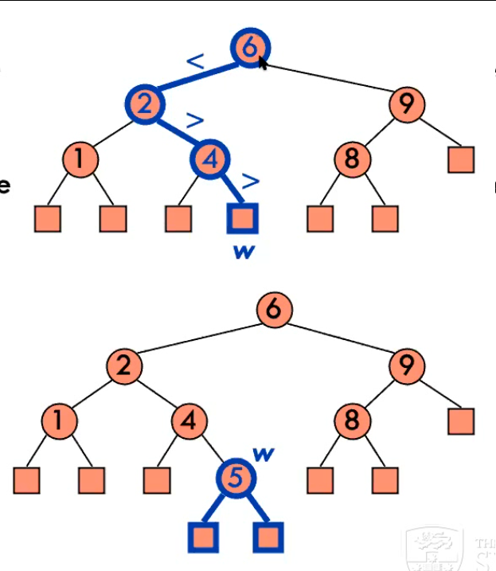
* `put(k,o)`, search for key k, if found, replace value, if not found, replace external node by internal node holding value
* `remove(k)`, search for key k, to find node w holding k
	* cases: w has 1 internal, 1 external child -> make the remaining subtree the node of the k parent
	* w has 2 internal children ->  find internal node y that has smallest key among the right subtree (keep going down left children). copy the entry and promote it to node y, appending k right child 
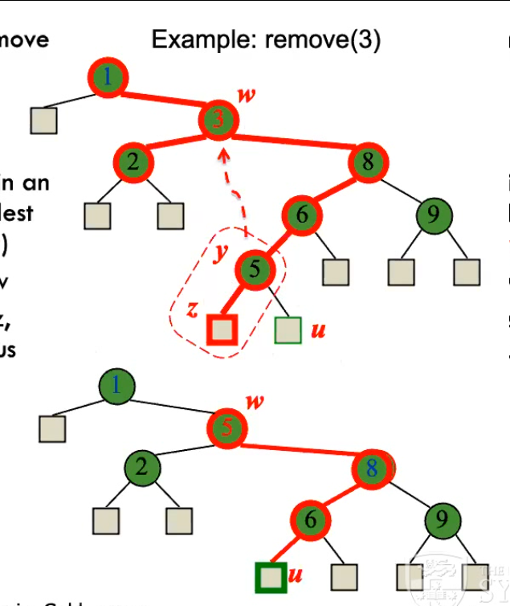

```py
def remove(k)
	w <- search(k, root)
	if w.isExternal() then #doesnt exist
		return null
	else if w has 1 external child z then #case 1
		remove z
		promote w to w
		remove w
	else #case 2
		y <- immediate successor of w #leftmost node in right subtree 
		replace contents of w with entry From y
		remove y
		promote y to w
		remove w
``` 

**duplicate keys**
* option 1: allow left decendant to be equal to the parents, such that `key(left) <= key(node) <= key(right)`
* option 2: use a list to store duplicates (would provide all of them rather than the most recently inserted one)

*range query* what are the keys between two values: `k1 <= k <= k2`
* restricted version of an inorder traversal: 
1. if current `key(v) < k1` recursively search right subtree until k1
2. if current `k1 <= key(v) <= k2` recusively search left subtree, add to range output, search right subtree
3. if current `key(v) > k2` recursively search right subtree
* when you reach a leaf, return nothing
* this method is a bit dumb

**performance**
* alg only visits boundary and inside nodes, such that `|inside nodes| <= |output|`
* `|boundary node| <= 2 * height`, as we perform 2 searches that are the height of the tree (to create the bounds)
* only spend `O(1)` time visiting each node, total running time is `O(|output| + height)` output is independant of input :O
* running time dependant on inside nodes only? not leaves 

**balanced BST**
* rank balanced tree, rank stores measure of the size of the subtree
* AVL trees, Red-Back trees
* if it only has leaves, its rank is 1
* the rank of two children is only allowed to differ by 1

* can prove by induction that `height of an AVL tree is < 2 log N(h)`
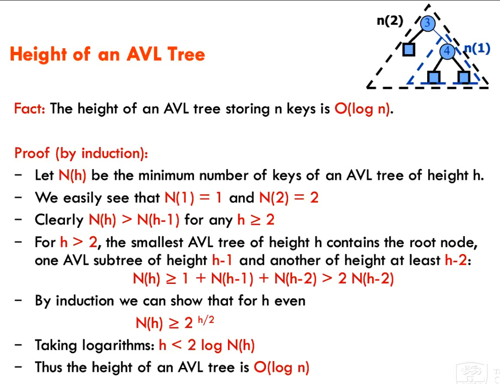

`insert(k)`
1. traverse through:
* if k is in tree, do nothing
* if no k, last external node w becomes new internal node containing k
	* may not have AVL balance property, as ancestors would increase by 1
	* find lowest ancestor where difference is >2, z
	* child of z that is ancestor of w, y
	* child x of y, ancestor of w
	* make z new node, left child y, right child of y x

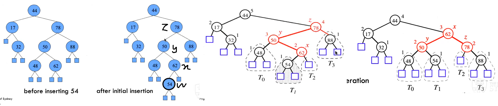  
* imagine the x node moving vertically up, making y, z its left and right node
* trinodial restructuring
*single rotation* when all are left children or right children
*double rotation* when not

* takes `O(1)`
! wont ever need to implement the rotations

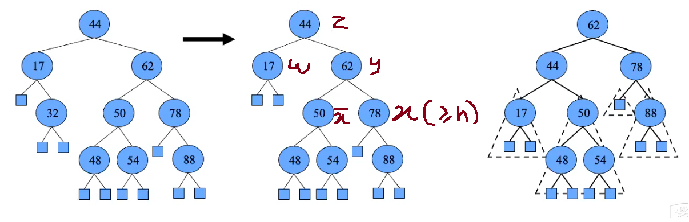

AVL TREE:
* O(n) space, O(log n) hieght, O(log n ) searching, insertion and removal

**map ADT**
* `get(k)`, `put(k, v)`, `remove(k)`, `keySet()` `values()` iteratable collections
* map doesnt detail how its stored, up to data structure
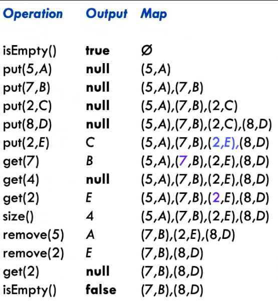

**sortedmap ADT**
* firstEntry(), lastEntry(), ceilingEntry(k), floorEntry(k),.. 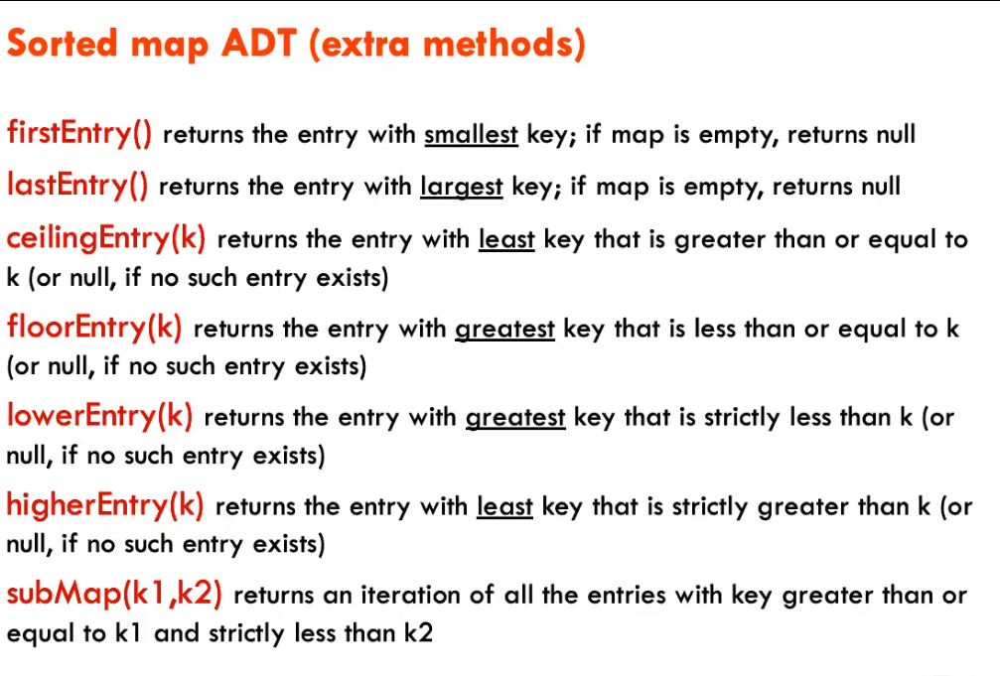
* O(logn) time for operations if using a avl tree

**index-based serching**
* different deficiencies on different lists
* could store index with key (would take logn), but O(n) time for insertions and deletions
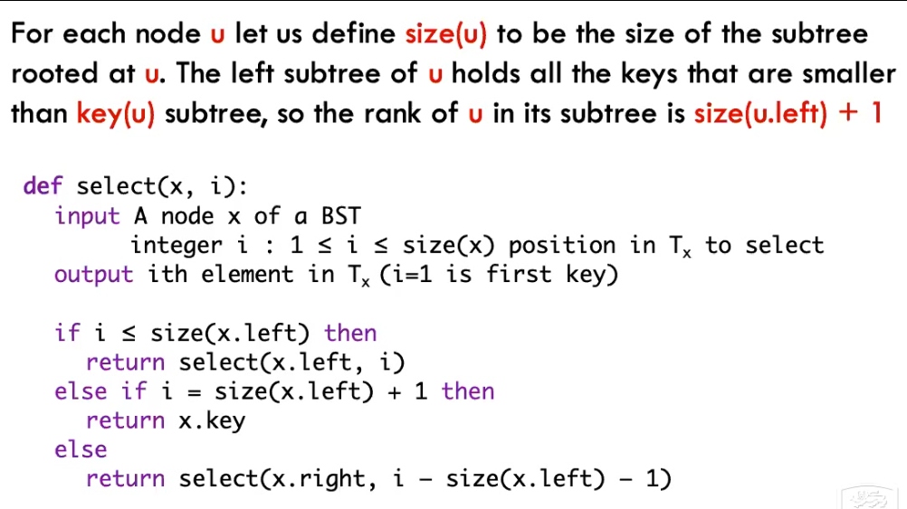

*total ordering* the comparing thing

#WEEK 5
#LECTURE 5: PRIORITY QUEUES
9:00m start

*priority queue* special type of map, stores key-value pairs, can only remove smallest key
* `insert(k, v)`, `remove_min()`
* `min()` return the smallest key, like the `top()` operation of stack
* this is a min-priority-queue, can build max
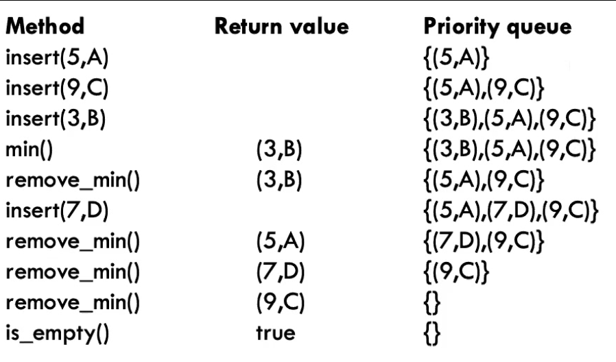

* rapidly removing things will get them back in sorted order

--> stock matching enginges
buyer: bid of x shares below y price
seller: ask of a shares above b price  
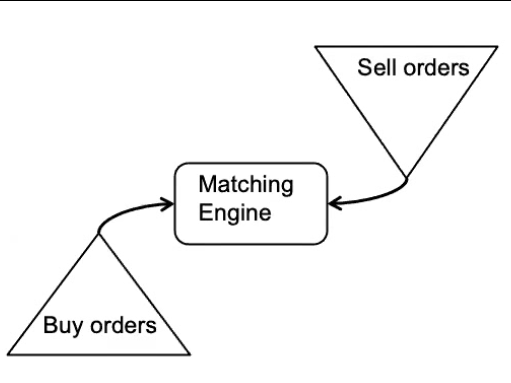

```py
while True:
	bid <- buy_orders.remove_max()
	ask <- sell_orders.remove_min()
	if bid.price >= ask.price then
	carry out trade (bid, ask)
	else
		buy_orders.insert(bid)
		sell_orders.insert(ask)
```
* lexographical order or something is used if two things are the same (first come first serve)
* cant do running time on an ADT

**implementations**
* unsorted list: O(1) insert, O(n) remove/peek
* sorted list: O(n) insert, O(1) remove/peak

**sorting**
*selection sortish* 

1. insert keys
2. iteratively `remove_min`, sorted order (O(n^2))

```def pq_sorting(A){
	pq <- new priority que
	n <- size(A)
	for i in [0, n] do
		pq.insert(A[i])
	for i in [0, n] do
		A[i] = pq.remove_min()
```

*selection sort*
1. insert elements [n inserts -> O(n)]
2. remove elements [n remove -> O(n^2)]
*inplace algs* algs that dont take extra space than the normal datatype

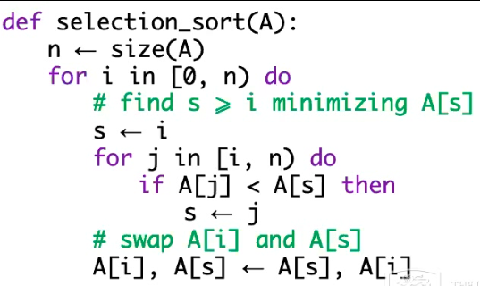
* keep sorted up to the processed index A[0, i]
* rest of array, A[i, n] is priority queue

--> start with first element, then check rest, swap minimum at the front

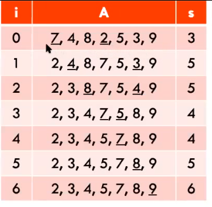

*insertion sort* if you have [earphone died] the opposite, the start is sorted, the ned is to be sorted
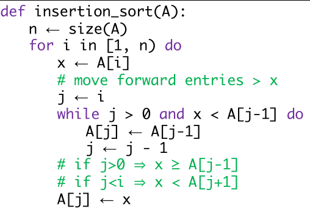
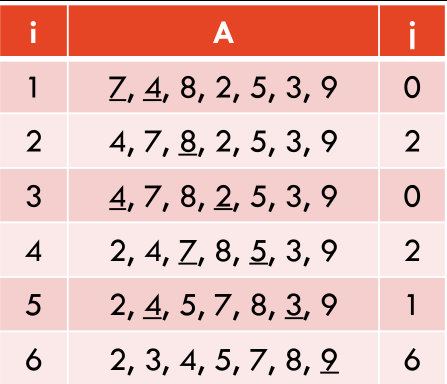


for  i: [1 -> size]
x: value of i
j <- i

while INARRAY and value of i < value of j-1:
	value of j <- value of j-1
	j--;

value of j <- x


for  i: [1 -> size]
x: 4
j = 1

4 < 7: true
while j > 0 and value of i < value of j-1:
	value of j <- value of j-1
	A[0] = 4; 
	j--;
	j = 0;

value of j <- x
A[0] = A[1]


from 1 -> 
store current val

for j val <- 0
	if val newprevious < value of current
		sorted already! no need
	let A[j] = A[previous]
	j--
A[j] = original


`if the current position has a bigger value to its left, then we keep switching it until its in the right place`

**heap**
*heap* binary tree storing (k, v) where:
1. for every node m, key(m) >= parent(m) [except for node], i.e. top smallest, biggest at the bottom
2. complete binary tree: i < h is full, each row is filled left to right

* root holds the smallest key in heap

RTP: assume min key is at internal node
* if x isnt root, then parents must hold a smaller key
* until root you gotta keep going

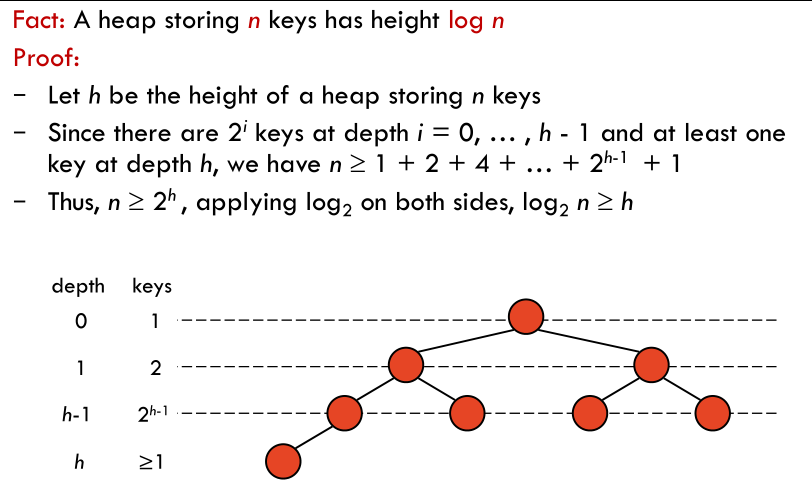

* insertion: insert into end [to retain binary tree property], then 
*upheap* restore heap order property by swapping keys along upwards parth 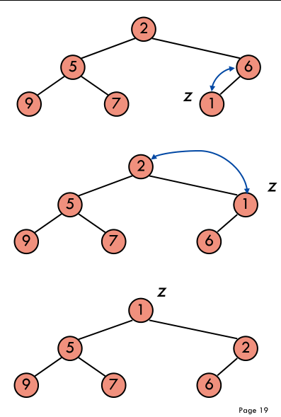, `O(log n)` time complexity
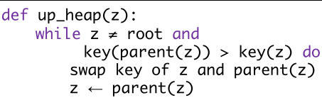

* finding position of insertion:
	1. start from last node
	2. go up, until previous was a left child: og to right, down until a leaf is reached
	3. if root is reached before left child -> open new level

*remove min?* replace root with last key w, deleting w
* restore heap order with 
*downheap* swapping keys along downwards path (`O(log n)` time complexity) 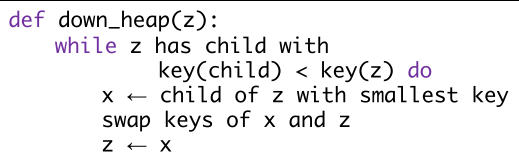
* if the key is smaller, swap with smallest key (so that the replacement works)
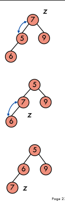


* find next last node after deletion `O(log n)`, start from postiion, go up until right, child,, if reach root need close a level

* heap implementation of priority queue
* min `O(1)`, isert `O(log n)`, removeMin `O(log n)`
* runs in `O(n log n)` time, rather than `O(n^2)` time i thing


**heap in array implementation**
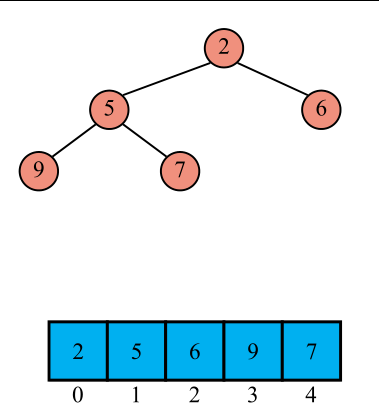
* for i; left child is `2i+2`, right child is `2i+2`, parent is `(i-1)/2`

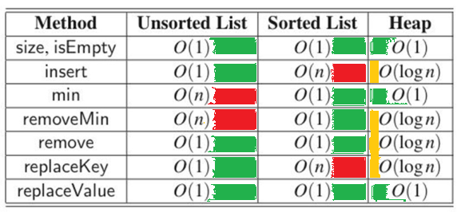
* entries: holds key/value pair
* comparators: compare key/value

* `i < 0` if `a ≺ b`
* `i = 0` if `a = b`
* `i > 0` if `a ≻ b`

two priority queues systems:
`(p, t, s)`
(p, t) -> price at time
