**COMP2123: Data Structures and Algorithms** (JAVA)

```
{ } 	Set
A ∪ B 	Union
A ∩ B 	Intersection
A ⊆ B 	Subset
A ⊂ B 	Proper Subset
A ⊄ B 	Not a Subset
A ⊇ B 	Superset
A ⊃ B 	Proper Superset
A ⊅ B 	Not a Superset
A^c 	Complement
A − B 	Difference
a ∈ A 	Element of
b ∉ A 	Not element of
∅	 	Empty set
```
```
O(1) constant time
O(n) linear time
O(n^2) quadratic time
O(e^n) exponential time
```
# WEEK 01

*computational problem* defines a task, what input --> expected output
*algorithm* the method from going from input to output (solution), language independant
*implementation* the specific method in a specific language

* correctness and complexity analysis: why the solution is correct, how efficent is it
* write in english/pseudocode `if... then... else` `for ... do...`, method calls `method (arg[, arg...])`, return values

**e.g.**
> We are given an array A of integers and we need to return the maximum 

We go through all elements of the array in order and keep track of the largest element found so far (initially−∞).So for each position i we check if the value stored at A[i]is larger than our current maximum, and if so we update the maximum. After scanning through the array, return the maximum we found.

OR

```py
max ← −∞
for i ← 0 to n − 1 do
if A[i] > max then
max ← A[i]
return max
```

* need to use induction to prove correctness 

We maintain the following invariant: after the k-th iteration, max stores the maximum of the first 0 elements.
Prove using induction: when k=0, max is−∞, which is the maximum of the first 0 elements.
Assume the invariant holds for the first k iterations, we show that it holds after the (k+1)-th iteration. In that iteration we compare max to A[k] and update max if A[k]is larger. Hence, afterwards max is the maximum of the first k+1 elements.
The invariant implies that after n iterations, max contains the maximum of the first n elements, i.e., it’s the maximum of A. 

* remember: indicies start at 0!

*efficency* An algorithm is efficient if it runs in polynomial time; that is, on an instance of size n, it performs no more than `p(n)` steps for some polynomial `p(x) = a(n)x^d+ a(1)x+···+a(1) + a(0)`
* runs quickly on real input instances? no, too dependant on implementation details
* based on number of steps, bound to worst-case performance

**Asymptotic growth analysis**
* `T(n) = O(f(n)) if T(n) <= cf(n)`
e.g. 
```
T(n) = 32n^2 + 17n + 32
T(n) is O(n^2) and O(n^3) [looser upperbound], but not O(n)
```
* Ω used for lower bounds
* θ used if its same for both

*polynomial* anything of O(n^c), 
*logarithmic* O(log n), like binary search
*exponential* O(2^n), like brute force algorithms

* transative `f = O(g), g = O(h) --> f = O(h), f + g = O(h)`
* halfing your input: logarithmic running time
 
*constant* `T(n) = θ(1)`
* assignments (a <- 42), comparisions (=, <=), boolean operations (and, not), basic maths
* `a <-- (2 * b + c)/4)`
* time it takes does not depend on size of the input

```
for i to j:			{O(j-i)} 
	sum += 1 {O(1)} 
```
* preprocessing: instead of doing something in a loop
`B(i) = A[0] + A[1] + .... + A[i]`

`A[i] + A[i+1] + ... + A[j] = B(j) - B(i-1)`

logarithmic, linear, quasi-linear, quadratic, exponential

* difference between problem, algorithm, implementation, analysis
* zero based indexing, slices [i:j], non basic data types are passed by reference, rather than copying everything

## TUTORIAL 0

**Summation notation**

**Logarithms and exponents**
**Floor and ceiling functions**
**Justification by counterexample**
**Justification by contrapositive**
**Justification by contradiction**
**Justification by induction**
**Basic probability**

*memebers/elements* objects in a set {`{7, 21, 57}`
*∈* membership, element ∈ set

1. a. `{1, 3, 5, 7, ...}`
the set of odd natural numbers

b. `{..., −4, −2, 0, 2, 4, ...}`
the set of even real numbers

c. `{n | n = 2m for some m ∈ N}`
the set of even real numbers

d. `The set containing the numbers 1, 10, and 100`
set containing powers of 10

e. `The set containing all integers that are greater than 5`
set of natural numbers > 5

c. The set containing all natural numbers that are less than 5
set of numbers 1-4

d. The set containing nothing at all
null set

3a. no, yes, [x, y], [x, y, z], [x,y,z] [x, y]


# BOOK NOTES

## 1.1.5 Asymptotic Notation
* f(n) is O(g(n))
* we substitute for 1?
*f(n) <= cg(n) if there exists a constant C for every value of this, from n>0 to n = inf*
* you wanna seperate each n power to get the simplist O
* some algorithms may have massive constants that are ignored by big O

## 1.1.6 The Importance of Asymptotic Notation
* in the long run, the asymptotically faster running times are better than ones with worse, but with lower constant factor

## 1.2.1 Summations

* typical geometric summation (gets larger!)
```c
(n->i=0)Σa^i = 1 + a + a^2 + ... a^n
//is equal to
1-a^(n+1)  /  1 - a
```

## Logs and Exponents

```c
log(b)a = c` if `a = b^c
log(b)ac = log(b)a + log(b)c
log(b)a/c = log(b)a - log(b)c
log(b)a^c = clog(b)a
log(b)a = logc(a)/log(c)b
b^log(c)a = a^log(c)b

log^cn = (log n)^c //notationally
```

*floor* [x] = the largest integer <= x
*ceiling* [x] = the smallest integer >= x

**1.2.3 simple justification techniques**
*generic* there is an element x in a set S that has property P. can also do a *counterexample*

```c
RTP: 2^i - 1, != P for i>1
test i = 4; = 15 untrue
```

*contrapositive* / *contraduction*, if p is true, q is true; establish that if q is not true, p is not true

```c
RTP: if ab = k - 1, a = l - 1, b = m - 1
lets prove the contrapositive, 
if ab = k, a = l, b = m
a = 2i or b = 2i
ab = (2i)b, hence ab is even in either case
establishes the contrapositive, hence original statement true
```

*de morgans law* negation of: p or q = not p and not q. negation of p and q = not p or not q

```c
//RTP: if ab is even then a is even or b is even
negated by not p, and not q
i.e. if:
a = 2m - 1
b = 2n - 1
a*b = (2m - 1) * (2n -1)
= 2mn - 2m - 2n + 1
2(mn - m - n) + 1
= odd
```

*loop invariant* 
1. intial claim S(o) is true before loop begins
2. S(i-1) is true before iteration i begins
3. s(k) implies the statement S

```c
//arrayFind(x, A), searches for element x in Array A
// produces i, such that x = A[i], or -1
i <- 0
while i < n do
	if x = A[i] then
		return i
	else
		i ++
return -1
```

**basic probability**
*sample space* S
*independant* if `Pr(A n B) = Pr(A) * Pr(B)`

*condutional probability* if event A occurs, given event B
`Pr(A|B) = Pr(A n B) / Pr (B)`

*random varaibles and expectation*
`E(X) = (->x)sum x*Pr(X = x)`

*q's will try and make you prove if something is asymptotically tight!*
*to find lowerbound, find a subset of something (usually half!)*


#big O notation
```py
O(n) + O(n) = O(n + n)
O(n) * O(n) = O(n * n)
O(k*n) = O(n)
```

```py
def summing_up(A)
	C ← new matrix of len(A) by len(A)
	for i in [0:n-1]
		for j in [i:n-1]
			compute average of entries A[i:j]
			store result in C[i, j]
	return C

def summing_up(A)
	C ← new matrix of len(A) by len(A)
	prevSum = 0;
	for i in [0:n-1]
		for j in [i:n-1]
			prevSum += A[j]
			average = prevSum/i
			store result in C[i, j]
	return C

```
*asymptotic bounding* when lowerbound and upperbound are the same

# WEEK 02 LISTS

*abstract data types* type defined bby what you want to store/have in your data structure (not a subset of a datastucture), the specficication
* interface between the user and the implementation (like the sterring wheel of a car)
* benefit: no need to reimplement the same data structure, higher, more abstract level, can replace the implementation of the ADT without affecting the user
* what your storing, what operations need to be stored > data structure: pseudocode of how the operations are supported >  actual implementation

`output method(input)`
* consider boundary cases, 

*data structure* concrete representation of data, from the POV of an implementer [array, linkedlist, ...], stores data and does operations (algo is apart of each component)

* `abstract base class` in python

* client code can have araibles that are instances of the data structure; methods on these varaibles (java . noation)

**index based lists**
* supports operations like: `size(), isEmpty(), get(i), set(i, e) [return replaced], add(i, e), remove(i)`

`get(i)`: constant time, can directly acsess the elements? as its not linked. need to make a check that it is a legitimate index

```py
def get(i)
# 
#
	if i < 0 or i >= then
		return "index out of bounds"
	else
		return A[i]
// O(1)

def set(i, e)
	if i < 0 or i >= then
		return "index out of bounds"
	out = A[i];
	A[i] <- e
	return out
O(1)
```

* add operation needs to shift things in the list
1. is the current elements filling up the array?
2. most time consuming: if we want to insert something at the start

```py
def add(i, e):
	if n = N then
		return "array full"
	if i < n then
		for j in [n-1, ni2, ..., i] do
			A[j+1] <- A[j]
	A[i] <- e
	n <- n + 1
O(n)
```

* the psuedocode is a data structure probably

```py
def remove(i)
	if i < 0, i >= n
		return "index out of bounds"
	e <- A[i]
	if i < n-1
		for j in [i, i+1, ... n-2] do
			A[j] <- A[j+1]
	n <- n - 1
	return e
O(N)
```
limitations in implementation:
* can only represent up to `N`
* space used is O(N), where O(n) better
* get/set good, add/remove O(n)

*postitional list* considers a number of `nodes` that store its element and a link to the next node, stemming from the head
* have to start at the start of the list, (not O(1) to search, O(n))
* supports operations like: `first() last() before(p) after(p) insertBefore(p, e), insertAfter(p, e), remove(p)` p position, e element
* be careful about `p.next.next` type things!

* `first()` O(1), constant time
* `insertFirst(e)`, new node, set e as element of x, repoint heads, O(1), `removeFirst(e)` similar
* `insertBefore(p, e)`, new node, point it to p, need to iterate through list to find p-1, takes O(n)
* finding p itself is constant time

* *doubly linked list* have pointers to the previous as well, with `header` and `trailer`
* to perform a `insertBefore(p,e)` can use `x.previous` and `x.next` to make the current things point to other things, and then change pointer of preivous and next to link as well; in O(1) time
* add/remove operations are O(1), cannot acsess specific elements in constant? time, but to accsess elements take O(n)


```py insertBefore(p, e) for dll
def insert_before(pos, elem):
	//handling for "pos"

	new_node <- instantiate
	new_node.element <- element
	new_node.prev <- pos.prev
	new_node.next <- pos
	pos.prev.next <- new_node
	pos.prev <- new_node

	return new_node
```
* `remove(p)` change previous and next pointers to feed into each other, dislocating p from the the list

```py remove(pos)
	#handling for "pos"

	pos.prev.next <- pos.next
	pos.next.prev <- pos.prev
	return pos.element
```

*linked list vs. arrays*
+ efficient insertion/deletion
+ can get bigger easily, no max capacity
+ matches positional ADT
- doesnt match index-based ADT
- array taversal faster w/ random access by index
- more memory intesive as it has to store pointers

**iterators**
*snapshot* freezes the contents of the data structure when iterating through it
*dynamic* follows changes to the data struct

in python:
* `iter(obj)` returns an iterator
* need to define `__iter__(self)`
* `__iter__()` returns object after calling `next()`, advancing the cursor or rasing `StopIteration()`

* i.e. repeatly call next() to cycle through the list

```py
for x in obj:
	pass

#is equiv. to 

it = x.__iter__()
try:
	while True:
		x = it.next()
		 pass
except StopIteration:
	pass
```

*space complexity* how much space does a certain data structure use, mostly O(n)
* data structures keep a variable for what size it is, since its common

**stacks and queues**
* restriced form of list, where insertions and deletions can only happen at specific parts
* less general ADTs benefit from being simpler/more efficent implemenations in certain cases

*stack* last-in-first-out (insert and remove at the end of the list); like a stack of plates
* `push(e)` inserts element to the end
* `pop()` removes last inserted element
* `top()` see the top thing
* `size()`, `isEmpty()`

* operations are in O(1)!!
* undo operations are implemented as a stack
* can be used to check if ([{}]()) match, push/pop to get stack empty

*method stacks* what the runtime environment uses to keep log during reccursion, pushes the value of varaibles onto the stack + the current code line position, pops when the recursion is done

**array implementation**
* have array of capacity `N`
* have a variable `t` that keeps track of the last index

```py
def size()
	return t + 1
def pop()
	if isEmpty() then
		return null
	else
		t <- t - 1
		return S[t+1]
def push(e)
	if t = N -1 then
		return "stack overflow"
	else
		t <- t + 1
		S[t] <- e
```

> if only once in a while an operation takes O(n) time, but its normally O(1) we call it " O(1) amortized time"

*queue* first-in-first-out (insert at the end of the list, remove from the start of the list)
* `enqueue(e)` adds element to end
* `dequeue()` removes first element
* `first()` peak first element

* buffering packet of e.g. streaming audio/video
* waiting lists, shared resources e.g. printers
* round robin scheduler: dequeues, performs task, requeues

**array implementation**
start
size
end = (start + size) mod N

* wrapped around configuration where end is before start, (i.e. start point at index k in an array, with elements until N then wrapping around to <N-k)

```py
def enqueue(e):
	if(size >= N):
		return "stack overflow"
	else:
		size[start+size mod N] <- e
		Q[end] <- e
		size <- size + 1

def dequeue():
	if(size == 0):
		return "none in queue"
	else:
		e <- Q[start]
		start <- (start + 1) mod N
		size <- size - 1
		return e
```

```py
stack:
[a] -> [a, b] -> [a, b, c] -> [a, b] -> [a]

queue: 
[a] -> [a, b] -> [a, b, c] -> [b, c] -> [c]

S1[] -> [a] -> [a, b] -> [a, b, c]
//need to remove a
//travese through first stack to fill second
S2[] -> [c, b, a]
//second array is organised correctly i think
```

# WEEK 3 TREES

**how to answer a question**
* whats its doing
* why what its doing is correct
* running time

> look at tutorial solutions to know things!

*tree* abstract model of a hierarchical structure, with a parent child relationship

*root* the head, doesnt have any parents
*internal node* nodes that have atleast one child
*external/leaf nodes* nodes without children

* nodes are bidirectional, parents/childs
* child can only have one parent
* can follow the parent until the node

*ancestors* nodes that can be reached by following parent pointers
*decenders* following all child nodes
*siblings* two nodes with the same parent

*depth of node* number of ancestors it has (including root) [start at element go up]

*height* maximum depth of all nodes of that tree (root is level 0) [start at element and go down]

*level* depth of tree grouping, root is level 0, its children is 1

*subtree* part of a tree, which creates a new "root", and all of its decendants

*edge* pair of nodes that are parent/child (u, v)

*path* sequence of nodes that traverse edges (doesnt have to be unique)

* ancestor/decendant realtionship are trasitive, ie. if a parent is a decendant, then the child also is

*lowest common ancestor* LCA; such that if z is the common ancestor of x, y, and z common ancestor that is the deepest in the tree
* the LCA of the root and something, may be the root

*ordered tree* children occur in a certain specific ordering, displayed from left to right

node object
* value, children [pointer to a list], parent (optional)

* generic methods: `size()` number of nodes being stored `isEmpty()` iterator`iterator()` `positions()` iterable `positions()`
* access methods: `root()`, `parent(p)`, iterable `children(p)`, integer `numChildren(p)`
* query methods: `isInternal(p)`, `isExternal(p)`, `isRoot(p)`

```py
def is_external(v)
	return v.children.is_empty()

def is_root(v)
	return v.parent = null
```

**traversing trees**
*traversal* visits the nodes of a tree in a systematic manner
* pre-order, post-order, in-order (for binary trees)

*preorder traversal* visiting the (starting) node before visiting the decendants
* if propograting something from roof to the elements, you use this
```py
def pre_order(v)
	visit(v)
	for each child w of v
		pre_order(w)
```
* every node of a subtree is visited before you go to the next subtree [same with post order traversal]; good for summing things up

*postorder traversal* visits each child before visiting the node itself
* if you need information from children, you use this node
```py
def post_order(v)
	for each child w of v
		pre_order(w)
	visit(v)
```
* order tree, go to the leftmost

*binary tree* every internal node has at most 2 children;
*proper* if every internal node has two children
* helpful for evaluating maths expressions: internal nodes become operators (does bodmas?)
* also for decision trees, internal nodes become yes/no
* left child or right child / left or right subtree
`leftChip(p)`, `rightChild(p)`, `sibling(p)`
* node just needs `left`, `right` and `parent`

```py
def is_external(v)
	return v.left = null and v.right = null
```
*inorder traversal* first visits entire left subtree, visits itself, then the right subtree
* more like postorder
* only should be for binary trees
* for maths good printing, but use post order for actually calculating
```py
def in_order(v)
	if v.left != null then
		in_order(v.left)
	visit(v)
	if v.right != null then
		in_order(v.right)
```

```py
def print_expr(v)
	if v.left != null then
		print("(")
		print_ expr(v.left)
	print(v.element)
	if v.right != null then
		print_expr(v.right)
		print(")")
```

```py
def eval_expr(v)
	if v.is_external() then
		return v.element
	else
		x <- eval_expr(v.left)
		y <- eval_expr(v.right)
		~ <- v.element
		return x ~ y
```
* push thing onto the stack, pop elements from the stack, apply the operator, and push it back onto the stack

*euler tour traversal* walking around the tree while keeping on the left of it
* if we visit first child: first (on the left) -> preorder
* second (from the bottom) -> inorder
* lastish (from the right) -> postorder

*calculating depth (recursively)*
```py
def depth(v)
	if v.parent = null then
		return 0
	else
		return depth(v.parent) + 1
```
*calculating height*
```py
def height(v)
	if v.isExternal() then
		return 0
	else
		h <- 0
		for each child w of v
			h <- max(h, height(w))
		return h + 1
```

* if the method calls on all of its children, ignoring recursion, the total amount of work is O(n) `linear in number of nodes`
* if it calls on at most one child/parent, worst case is O(n), cost is `linear to height of tree` **O(h)**

* with binary tree, you can do O(log(n)) [week 5]

# WEEK 04 TREES

*key* the comparision thing, the number
*value* the value
*entry* the key value pair

*binary search tree* binary tree that stores keys/key-value pairs, where it is ordered from left to right, such that an inorder traversal has keys in an increasing order
[bst](2123/21230.png)
* doesnt have to store any possible key
* use a comparator function to compare non integer values
* storing keys only in external nodes make things more complicated, store only in internal nodes
* only searching by key
```py
def search(k, v) #key, value
	if v.isExternal() then #fail
		return v
	if k = key(v) then #valid
		return v
	else if k < key(v) then #go left
		return search(k, v.left)
	else #go right
		return search(k, v.right)
```
* initally pass in the root for v
* runs in `O(h) -> O(n)` time, worst case: `h = n - 1`, best case: `h < logn`
* having unique keys makes it easier

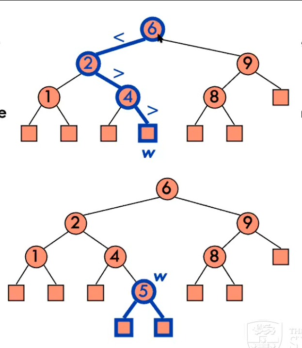
* `put(k,o)`, search for key k, if found, replace value, if not found, replace external node by internal node holding value
* `remove(k)`, search for key k, to find node w holding k
	* cases: w has 1 internal, 1 external child -> make the remaining subtree the node of the k parent
	* w has 2 internal children ->  find internal node y that has smallest key among the right subtree (keep going down left children). copy the entry and promote it to node y, appending k right child 
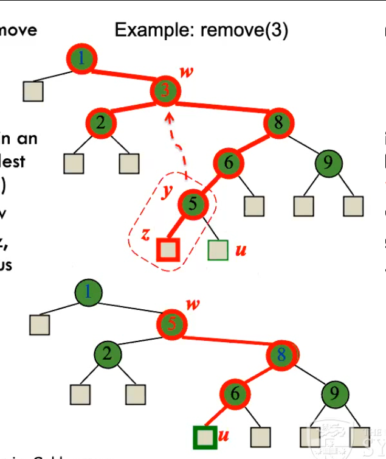

```py
def remove(k)
	w <- search(k, root)
	if w.isExternal() then #doesnt exist
		return null
	else if w has 1 external child z then #case 1
		remove z
		promote w to w
		remove w
	else #case 2
		y <- immediate successor of w #leftmost node in right subtree 
		replace contents of w with entry From y
		remove y
		promote y to w
		remove w
``` 

**duplicate keys**
* option 1: allow left decendant to be equal to the parents, such that `key(left) <= key(node) <= key(right)`
* option 2: use a list to store duplicates (would provide all of them rather than the most recently inserted one)

*range query* what are the keys between two values: `k1 <= k <= k2`
* restricted version of an inorder traversal: 
1. if current `key(v) < k1` recursively search right subtree until k1
2. if current `k1 <= key(v) <= k2` recusively search left subtree, add to range output, search right subtree
3. if current `key(v) > k2` recursively search right subtree
* when you reach a leaf, return nothing
* this method is a bit dumb

**performance**
* alg only visits boundary and inside nodes, such that `|inside nodes| <= |output|`
* `|boundary node| <= 2 * height`, as we perform 2 searches that are the height of the tree (to create the bounds)
* only spend `O(1)` time visiting each node, total running time is `O(|output| + height)` output is independant of input :O
* running time dependant on inside nodes only? not leaves 

**balanced BST**
* rank balanced tree, rank stores measure of the size of the subtree
* AVL trees, Red-Back trees
* if it only has leaves, its rank is 1
* the rank of two children is only allowed to differ by 1

* can prove by induction that `height of an AVL tree is < 2 log N(h)`
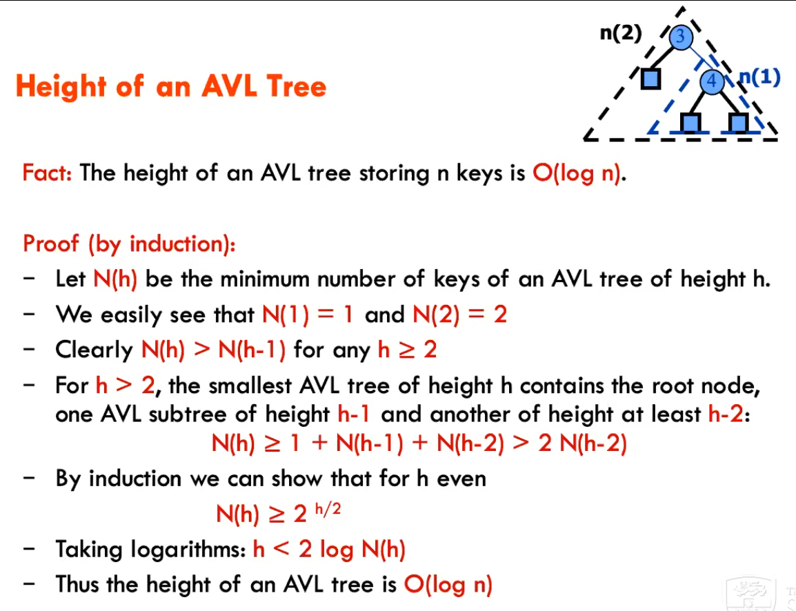

`insert(k)`
1. traverse through:
* if k is in tree, do nothing
* if no k, last external node w becomes new internal node containing k
	* may not have AVL balance property, as ancestors would increase by 1
	* find lowest ancestor where difference is >2, z
	* child of z that is ancestor of w, y
	* child x of y, ancestor of w
	* make z new node, left child y, right child of y x

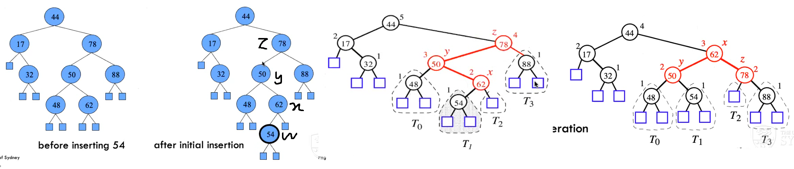  
* imagine the x node moving vertically up, making y, z its left and right node
* trinodial restructuring
*single rotation* when all are left children or right children
*double rotation* when not

* takes `O(1)`
! wont ever need to implement the rotations

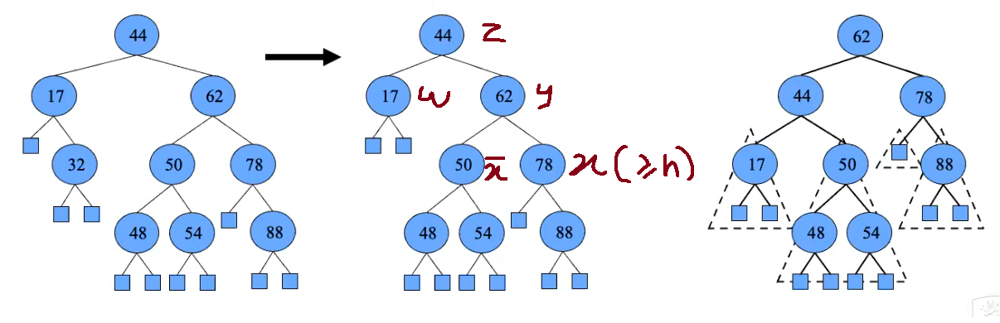

AVL TREE:
* O(n) space, O(log n) hieght, O(log n ) searching, insertion and removal

**map ADT**
* `get(k)`, `put(k, v)`, `remove(k)`, `keySet()` `values()` iteratable collections
* map doesnt detail how its stored, up to data structure
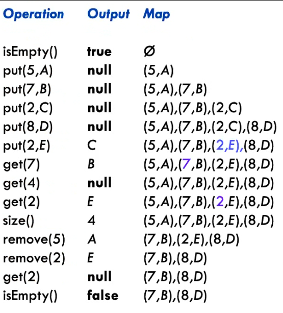

**sortedmap ADT**
* firstEntry(), lastEntry(), ceilingEntry(k), floorEntry(k),.. 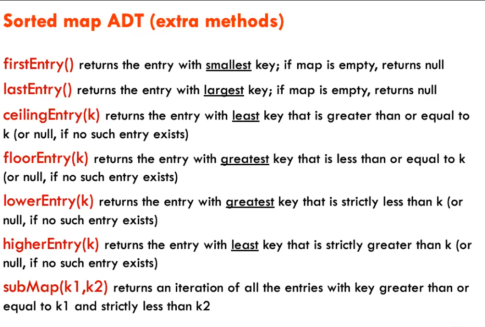
* O(logn) time for operations if using a avl tree

**index-based serching**
* different deficiencies on different lists
* could store index with key (would take logn), but O(n) time for insertions and deletions
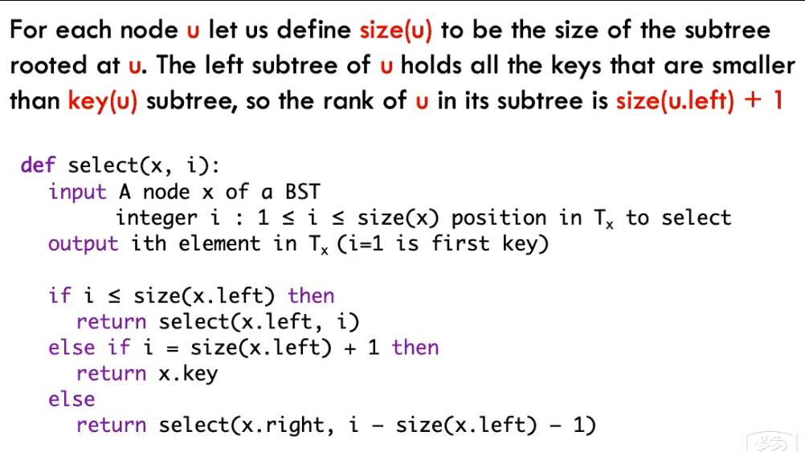

*total ordering* the comparing thing

# WEEK 05 PRIORITY QUEUES

*priority queue* special type of map, stores key-value pairs, can only remove smallest key
* `insert(k, v)`, `remove_min()`
* `min()` return the smallest key, like the `top()` operation of stack
* this is a min-priority-queue, can build max
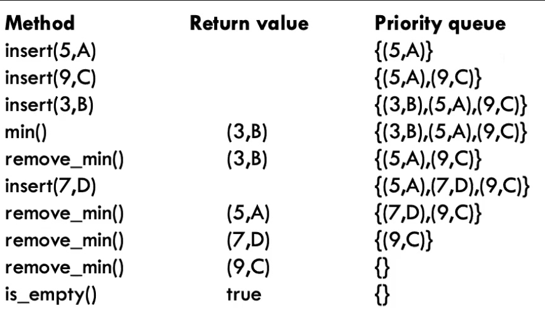

* rapidly removing things will get them back in sorted order

--> stock matching enginges
buyer: bid of x shares below y price
seller: ask of a shares above b price  
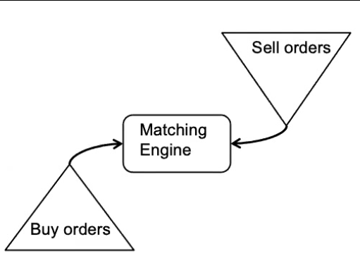

```py
while True:
	bid <- buy_orders.remove_max()
	ask <- sell_orders.remove_min()
	if bid.price >= ask.price then
	carry out trade (bid, ask)
	else
		buy_orders.insert(bid)
		sell_orders.insert(ask)
```
* lexographical order or something is used if two things are the same (first come first serve)
* cant do running time on an ADT

**implementations**
* unsorted list: O(1) insert, O(n) remove/peek
* sorted list: O(n) insert, O(1) remove/peak

**sorting**
*selection sortish* 

1. insert keys
2. iteratively `remove_min`, sorted order (O(n^2))

```def pq_sorting(A){
	pq <- new priority que
	n <- size(A)
	for i in [0, n] do
		pq.insert(A[i])
	for i in [0, n] do
		A[i] = pq.remove_min()
```

*selection sort*
1. insert elements [n inserts -> O(n)]
2. remove elements [n remove -> O(n^2)]
*inplace algs* algs that dont take extra space than the normal datatype


* keep sorted up to the processed index A[0, i]
* rest of array, A[i, n] is priority queue

--> start with first element, then check rest, swap minimum at the front

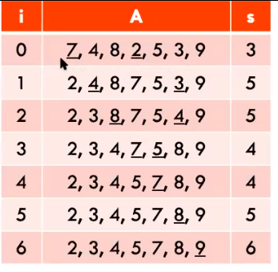

*insertion sort* if you have [earphone died] the opposite, the start is sorted, the ned is to be sorted
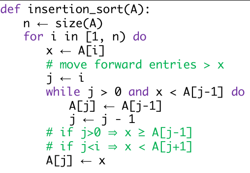
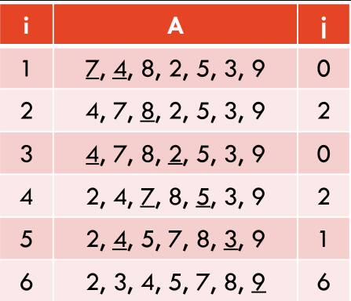

```py
for  i: [1 -> size]
x: value of i
j <- i

while INARRAY and value of i < value of j-1:
	value of j <- value of j-1
	j--;

value of j <- x


for  i : [1 -> size]
x: 4
j = 1

4 < 7: true
while j > 0 and value of i < value of j-1:
	value of j <- value of j-1
	A[0] = 4; 
	j--;
	j = 0;

value of j <- x
A[0] = A[1]


from 1 -> 
store current val

for j val <- 0
	if val newprevious < value of current
		sorted already! no need
	let A[j] = A[previous]
	j--
A[j] = original
```

`if the current position has a bigger value to its left, then we keep switching it until its in the right place`

**heap**
*heap* binary tree storing (k, v) where:
1. for every node m, key(m) >= parent(m) [except for node], i.e. top smallest, biggest at the bottom
2. complete binary tree: i < h is full, each row is filled left to right

* root holds the smallest key in heap

RTP: assume min key is at internal node
* if x isnt root, then parents must hold a smaller key
* until root you gotta keep going

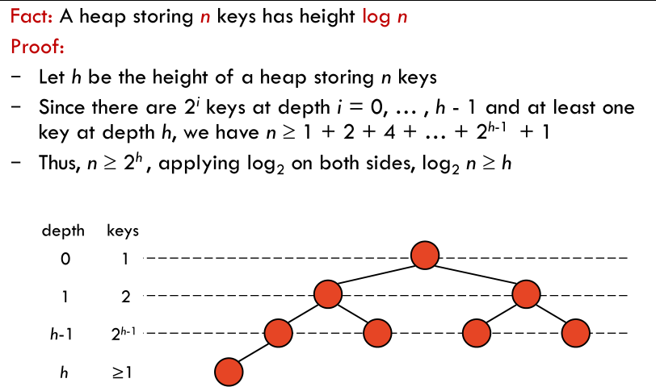

* insertion: insert into end [to retain binary tree property], then 
*upheap* restore heap order property by swapping keys along upwards parth 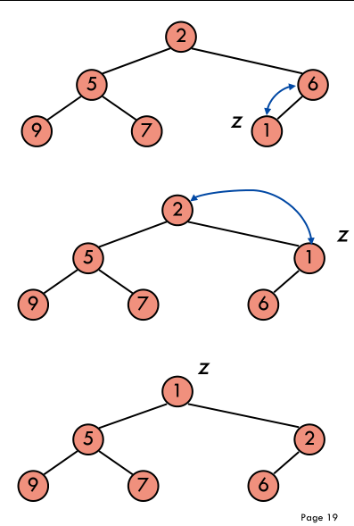, `O(log n)` time complexity
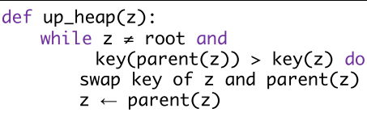

* finding position of insertion:
	1. start from last node
	2. go up, until previous was a left child: og to right, down until a leaf is reached
	3. if root is reached before left child -> open new level

*remove min?* replace root with last key w, deleting w
* restore heap order with 
*downheap* swapping keys along downwards path (`O(log n)` time complexity) 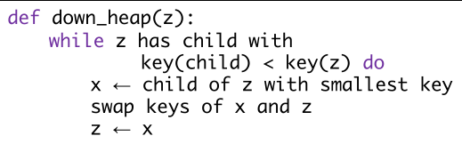
* if the key is smaller, swap with smallest key (so that the replacement works)
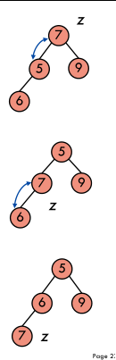


* find next last node after deletion `O(log n)`, start from postiion, go up until right, child,, if reach root need close a level

* heap implementation of priority queue
* min `O(1)`, isert `O(log n)`, removeMin `O(log n)`
* runs in `O(n log n)` time, rather than `O(n^2)` time i thing


**heap in array implementation**
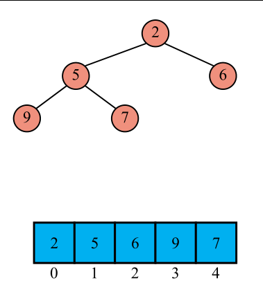
* for i; left child is `2i+2`, right child is `2i+2`, parent is `(i-1)/2`

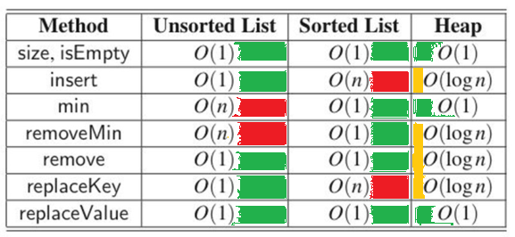
* entries: holds key/value pair
* comparators: compare key/value

* `i < 0` if `a ≺ b`
* `i = 0` if `a = b`
* `i > 0` if `a ≻ b`

two priority queues systems:
`(p, t, s)`
(p, t) -> price at time

# WEEK 06 Hash Tables

* hash table is good in practice, but upper bound is high
* usecase: routers for networks, want to know which port to forward on
* `get(k)`, `put(k, c)`, `remove(k)` in hopefully constant time


*maps* type that store key value pairs, and also allows you to return iterable collections of `entries()`, `keys()`, `values()`

* storing in a simple list based map
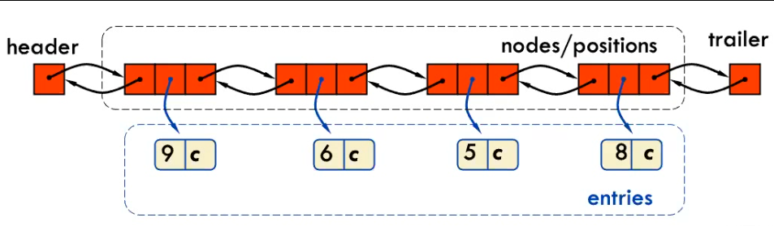
* put, get, remove take `O(n)` time
* put takes `O(1)` time if the key doesnt exist yet (or dont need to check it)

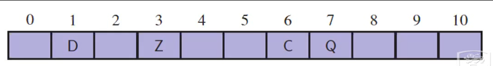
* if we use an array, and we dont need to shift entries around
* requires the space for the all possible keys (potentially terrible space efficiency), cannot handle non-number keys
* `O(1) get, put, remove`

*hash function* 1. (hash code)whatever you use as a key gets transformed into an integer, 2. (compression function) try to restrict it to the size of a smaller table (0 --> N-1)  (map big number to small)
`key(x) --> Array[hashFunction(x)]`
* e.g. `h(x) = x % N`

*hash value* the output of hash function, `h(x)`

*hash table* is an implementation of map that tries to condense indexes (of fixed interval `[0, N-1]`)


* picking good has functions are not easy :/
* simpler hash function is, the worse! (usually)
* goal: disperse keys in a random way, not hashing things to same location

`h(x) = compression(hashcode(x))`

**approaches to hashcodes**
* key as a tuple of integers, each in range of `[0, M-1]` (strings, image)
* view key as nonnegative integer (ip adress, account number)

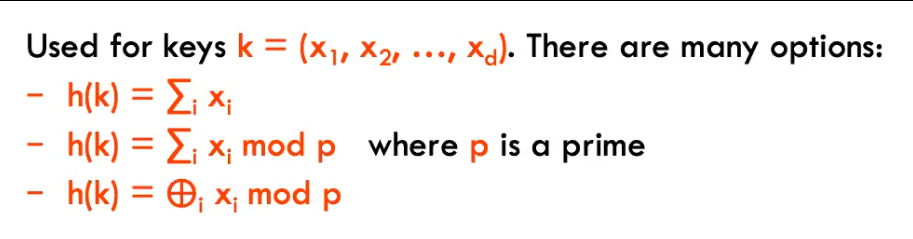
* issue: for a dictionary, "mate", "meat" index to same thing

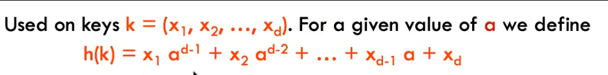
* polyarithmic, order is considered
* `O(d)` time, amount of exponents

**modular division**
* `h(k) = k mod N` for some prime number N
* if keys are randomly distributed in `[O, M], M > N; probability of collision is 1/N` (not usually the case)

**universal hash function**
* if we have a family of has functions (such as k % 1 -> k % n) = H; H is 2-universal if picking h uniformly at random is `Pr[h(i) = h(j)] <= 1/N`

**random linear hash function**
* multiply key by constant, then add constant, mod prime constant, mod size `h(k) = ((a*k + b)%p)%N`
* probability of collision is `1/N`, (keys are 0->M, p > M, a,b randomly from 1 -> p-1)
* expected collisions is n/N (load factor) --> O(1 + n/N)

--> 6.3 GT

**separate chaining**
* make each index a linked list
* expected time, `O(1 + n/N)` [computing the has value + performing of operation] , worst case is `O(n)`

**linear probing**
*open addressing* colliding item placed in different cell

*linear probing* places the colliding item in the next (circularly) avaliable cell

* need to traverse through part of the array to get it

* start at cell h(k)
* check if it has what its looking at, until: k found OR empty cell found OR N cells probed

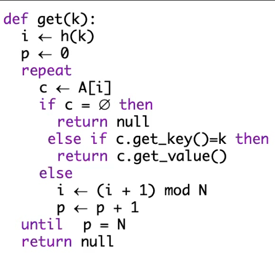
* insertions and deletions require handling, achieved through `DEFUNCT` object
	* remove(k) replaces removed cell with DEFUNCT
	* get(k) must pass over DEFUNCT
	* puut(k, o): remember first DEFUNCT/empty

* expected time for get() and put() is `1/(1 - n/N)` 
* worst case: `O(n)` time

implementations:
java, n/N < 0.75, uses chaining/bsl chaining
python, open adressing n/N < 0.66, creates new 2N table

**cuckoo hashing**
* two hash tables
* `O(1)` for get, remove, only have to check 2 cells 
* `O(n)` for put if `N > 2n`
* 30% slower than linear probing, but has worst case guarantee
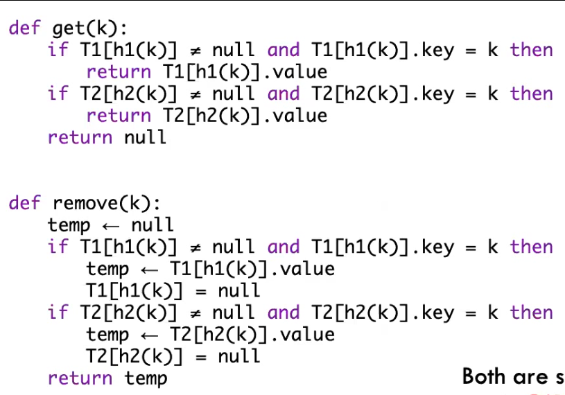

* put function: if no valid space, then forces item in previous cell to go to its respective cell, continous "eviction" --> untill empty cell or repetition 
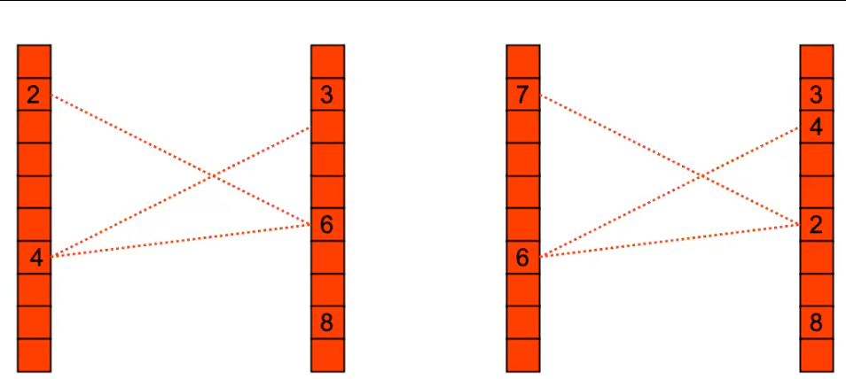
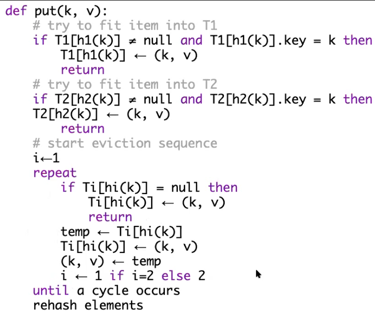

* detecting eviction cycles: have a counter, or have a flag with each entry (that we need to unflag later)

*set* unordered collection of unique elements
* add(e), remove(e), contains(e), iterator()
* addAll(T) union, retainAll(T), intersection, removeALl(T) subtraction
* store keys ignore values in map

*multiset*
* count(e) that returns how many times an element is in one multiset
* remove(e) removes one occurance
* (k, count) for map implementation

# WEEK 07 GRAPHS

**graphs**
* pair (V, E)
*vertex* a nodes
*edges* collection of pairs of vertices
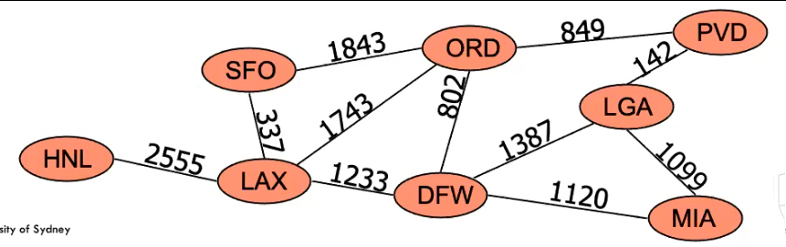
* typically each vertex and edge (line segment), stores data

*undirected edge* unordered pair of vertices (e.g. a two way road SYD--MEL)
*directed edge* u, v such that one is the tail (origin) and one is tail, and the other one is head (destination)

**undirected definitions**
*endpoints*, the vertices that connect to a line segment (edge)
*incident edge* the edges that connect to a specific vertex
*adjacent/neighbour vertices* when connected by an edge
*degree* (of vertex) the number of edges it has

*parallel edges* edges that go from and to the same vertices
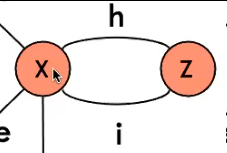
*self loop* edge that has both endpoints being the same vertex
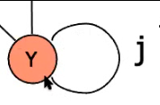
*simple* catagory of graph that doesnt have parallel or self-loops

**directed definitions**
*out degree* how many edges propogate from a node (edge outgoing)
*in degree* how many edges are consumed by a node (edge incoming)
*direct parallel edges* share the same tail and head

*path* a sequence of vertices so that everything is connected with edges
*simple path* all the vertices on a path that are distinct, doesnt repeat

*cycle* a path that starts and ends at the same vertex
*simple cycle* distict vertex cycle
*acyclic graph* graph that doesnt have cycles (trees)

*subgraph* a partial graph, where all of its vertexes and edges are apart of another graph

* subgraph induced by vertices: choose vertices, and connect them
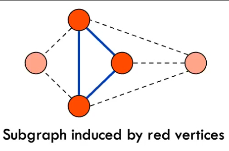
* subgraph induced by edges:
choose edges, then add your vertices

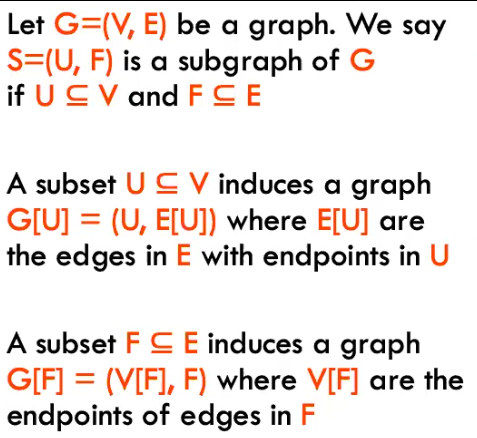

**connectivity** 
* if there is a path between every vertex, its connected!
* disconnected graph, if there isnt!
*connected component* subgraph of a graph, cant add any more edges to it while keeping it connected; maximal connected
* a single vertex is a connected component

**trees and forests**
* tree is a graph if its *connected* and *acyclical*
*unrooted* no defined root of the tree
* every tree of `n vertices has n-1 edges` (by induction)

* anything thats a tree could be built as a graph (but cant use search properties, which a tree adt is built for)
*forest* graph that is *acyclical* (doesnt have to be connected, i.e. a collection of trees) [note: a tree by itself can be a forest]

*spanning tree* subgraph of a connected graph, that connects all vertices of a graph, that is acyclical
* minimize the edges you need to connect all vertices graph

*spanning forest* subgraph of input graph, where each connected component is a spanning tree

`n:  	vertices
 m: 	edges
 delta: maximum degree`

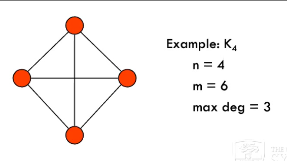

* `sum of each vertex degrees = 2*edges`
* for a simple undirected graph, `m <= n(n-1)/2`
	* for a graph of n vertices, you can have a quadratic number of edges
* for a simple directed graph, `m <= n(n-1)`
	* because we can double the amount of edges

**graph adt**
* three data types: vertex, edge (both store an object and have a retrival method), graph
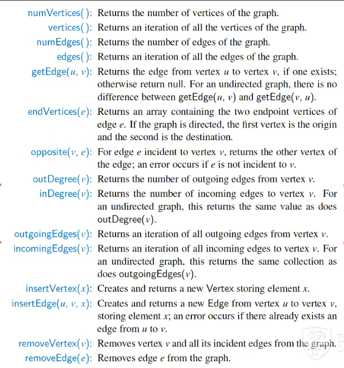
* for undirected graph, `degree(v), incidentEdges(v)` (rather than in/out versions)
`insertVertex(x)` just creates a node, indepent of edges: need to `insertEdge(vertex_a, vertex_b, x)` to connect things

*edge list*
* list of edges, each edge index points to data structure that has:
* pointer to its index, pointer to its vertices [pointed to by list of vertecies], what it stores
* from a vertex you cant access edges 
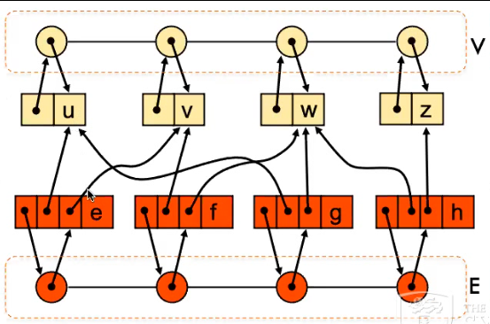

*adjacency list*
* extra data structure, that has "a incident edge list", which vertex and edge data stuctures both point to
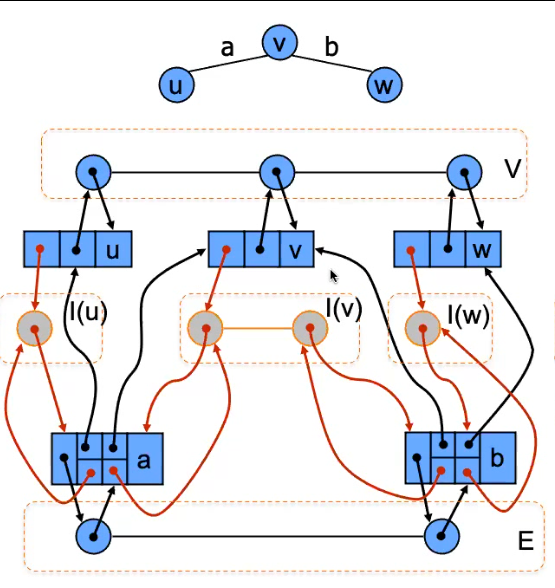

*adjacency matrix*
* two dimentional matrix, vertex are mapped from `0 to n-1`
* the position (a, b) [z] represents two vertices at positions a, b, that are connected by edge z
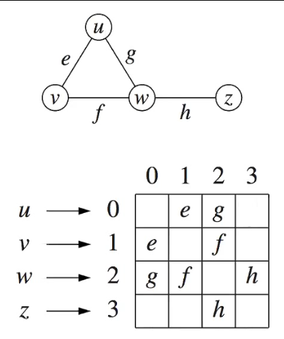

performance
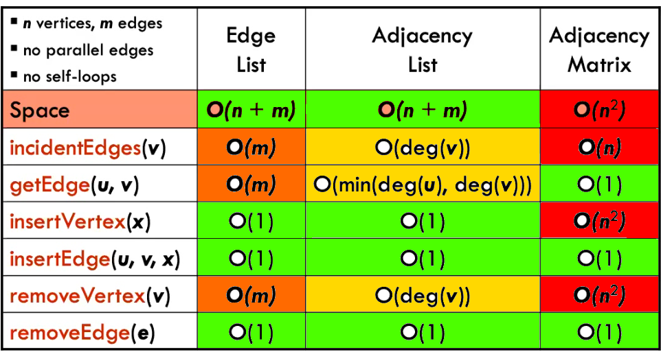
* adjacency list: incident list, loop through list deg(v)
* adjacency list: getting edge, scanning through shorter of incident lists of nodes of u or v (the min of)
* `O(n^2)` size for changing the table (adding/removing a new vertex), so bad for inserting a lot of vertices

**graph traversal**
* visit all the vertices and edges in a systematic way, 
* `O(n + m)` vertices + edges

*depth first search*
* goes down, backtracks if stuck
* finds edge that hasnt been visited, if not goes down it
* backtrack (through parent) and look through other edges
* dfs edges will form a spanning forest

*dfs edge* an edge that discoveres a new vertex
*back edge* one that doesnt
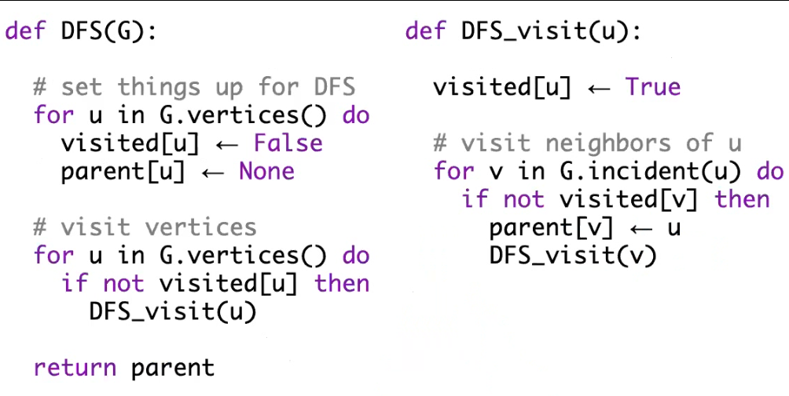
* G.incident(u) getting all the incident edges using the ADT


* setting up `O(n)`
* `O(deg(u))` time to loop through incident edges (assuming adjacency list exists)
* DFS_visit(v) is called once per vertex, so its the sum of the degrees of the verticies -> `O(2m)`

* find a path between two verticies, find cycle, if connected, computing spanning tree, compute connected components ...

*cut edge* if the edge is removed from a graph, it becomes not connected, disconnecting it
* if there is none, then its a *biconnected component* 

* `O(m^2)` alg for finding them: for each edge, remove, and check if DFS, put back
* `O(nm)` we only have to test edges apart of dfs tree, reduces the amount of edges from m -> n
* `O(n+m)` 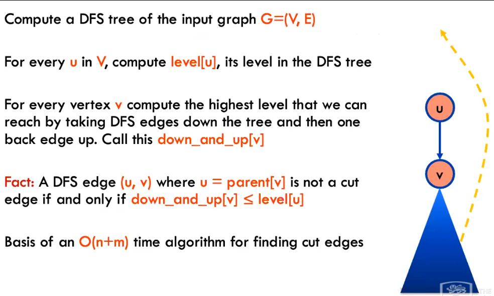
	* make one vertices of dfs tree root
	* check the level of its decendants
	* compute highest level: dfs edges down and one back edge up
	* DFS edge is not a cut edge if `down_and_up[v] <= level[u]`, if we end up higher than the than the parent doing down_and_up then its a cut edge
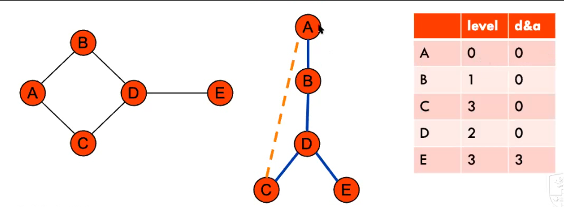

*breadth first search*
* give all vertices in one hop, then two hops
* start with `L0 = {s}`
* `L1 = verticies one hop from s`
* `L2 = verticies two hop from s`
* `Lk = verticies k  hops from s` 

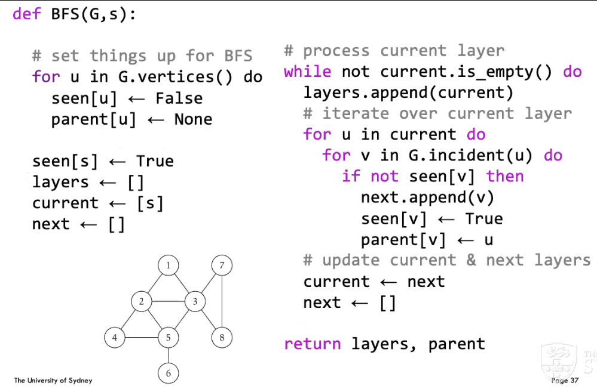
* LHS `O(n)`
* RHS `O(sum of deg(u)) = O(m)` [if adjecency list]
* overall, `O(n+m)`
* on adjacency matrix, it becomes `O(n^2)`


* doesnt visit non connected component, only a single connected component, forming a spanning tree
* for each vertex of a specfic layer, there is a path from the root to that vertex with its height amount of edges
* i.e. any path need in layer i needs to use atleast i edges to get to s

* usecase: finding shortest path, funding cycle, seeing connectedness, computing spanning tree of connected graph
* testing if graph is *bipartite* (where group of nodes a and b only connect with vertices of the other group)

| applications | DFS | BFS |
| ------------ | --- | --- |
| spanning forest, connected components, paths, cycles | yes |yes |
| shortest paths | no | yes |
| biconnected components | yes | no |

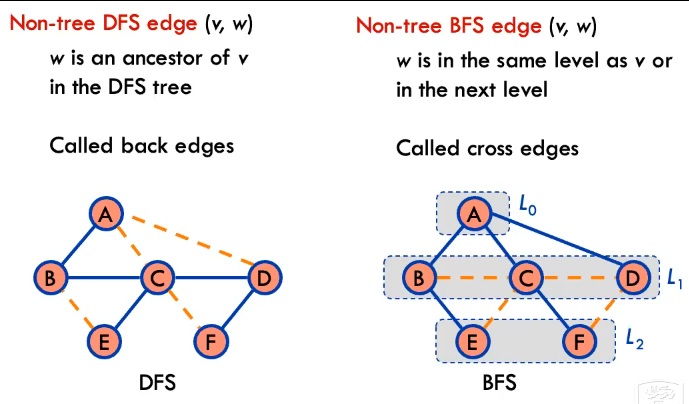

*cross edges* non tree edges of bfs edges, where vertices can be in the same level or in the next level from each other (back edges are ancestors only)

---

*question*
is something like `arr[n] = {0}` linear or constant time?
* if you had an array that never clears what is removed, what is the O(n) time?

# WEEK 08
* edges have a weighted graph
* any subpath of a shortest path is a shortest path

*shortest path tree* the union of all the shortest path from a vertex to all other vertexes

**dijkstra algorithm**
* output: distance from starting to every other vertex, and the tree
* cant have negative edge weights!

* have an array keeping an array of the distance estimate (upperbound), that we dont know
* and exact knowledge about

intially:
`D[s] = 0`
`D[v] = inf, for all v in V - s`

* pick the vertex with the current smallest distance
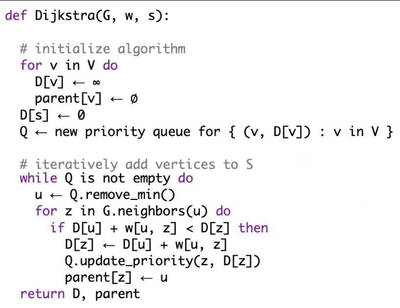
* uses a priority queue to get min, perform edge relaxation

*edge relaxation*
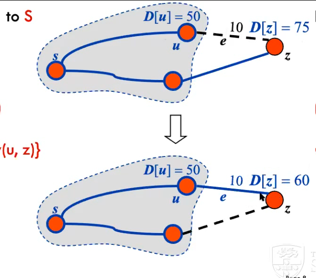
* update distance to shorter path

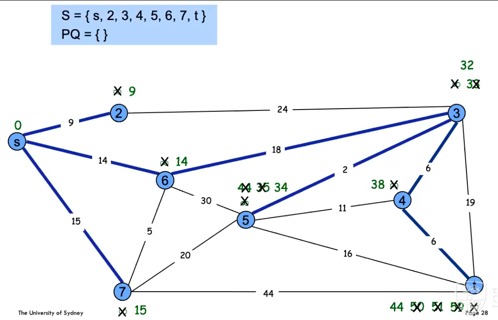

alg takes `O(m)` + for PQ, we have `n` insertions, `m` decrease key, `n` remove min
* as a heap PQ, `O(m log n)`
* a fibonacci heap makes decreased key `O(1)` time, which is `O(m + nlogn)`
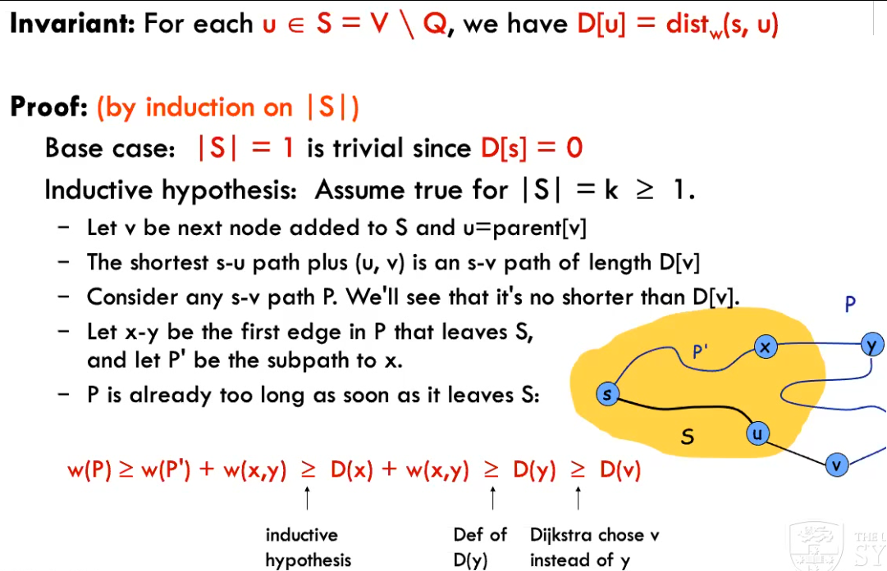

**minimum spanning tree**
* can use this for travelling salesperson problem, approximatation algorithm
* this is minimising the total length of the tree, so cant use djistra

* assume: every edge cost is distinct
*cut property* any subset of graph, looking at edges inbetween, the minimum cost is the one minimising in the the tree (include one)
*cycle property* if there is a cycle, the edge with highest edgeweight isnt going to be apart of tree (exclude one)

* intersection of cycle and cut, has an even number of edges (its goota come back!)

**prims alg**
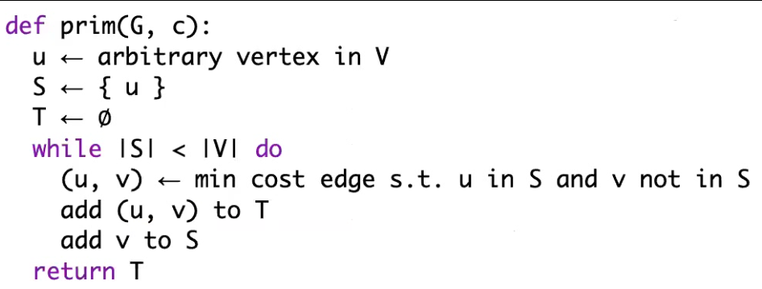
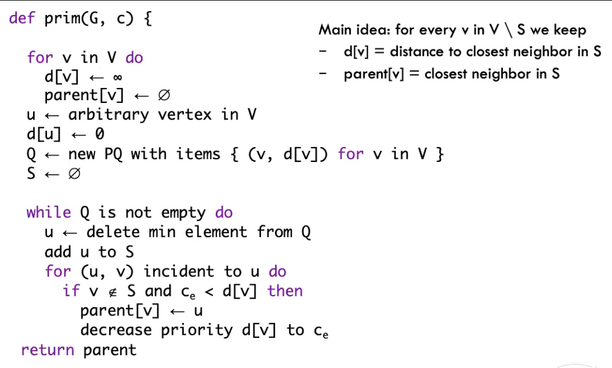
* like dijkstra but you dont computate the sum, just the single distance
* same running time as dijkstra

* does 0 first
* then records all edges
* continues on smallest distances 

**kruskal alg**
* get edges in ascending order
* if adding an edge makes it a cycle, dont need to add it because of cycle property
* insert into e using cut property
sorting edges: `O(m log m)`
testing if adding a new edge creates a cycle: can do with dfs, `O(m*n)`
* can do it better with:

**union find ADT**
* used to keep track of an evolving partition of elements
`make_sets(A)` make singleton sets with elements in a, `O(n)`
`find(A)` returns an id for the set an element belongs to `O(1)`
`union(A, B)` union sets a and b merges to, `O(n)`
* cant undo unions

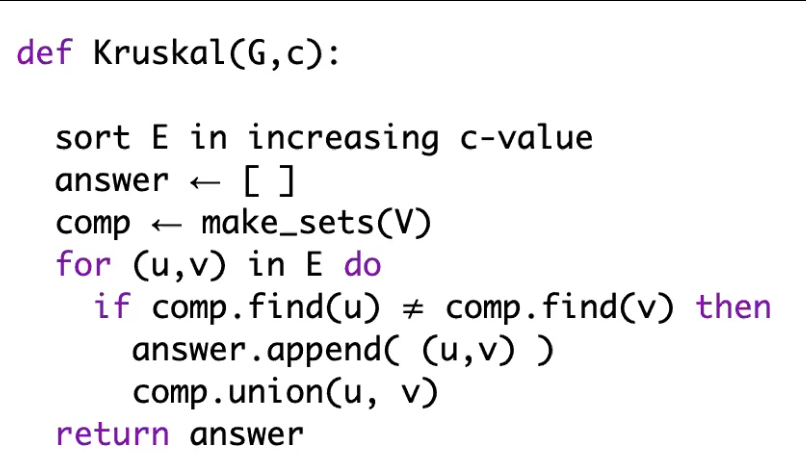
* after edge weights are sorted, is in `O(n^2)`

*lexicographical tiebreaking* 
* could add i/n^2 to every edge (smaller than 1), every edge will have unique weights
* or you just do it in lexicogrpahically

# WEEK 9

*greedy algorithims* build solution one step at a time making locally optimal choices at each stage in the hope of finding a global optimum solution

```py
def greedy(input)
	initialise result
	determine order

	for each i of input do
		if i improves result then
			update result with i
	return result
```
* proof using *exchange argument*
* consider solution x > greedy, and wha tit requires
`O(n log n)` to sort items, `O(n)` to process
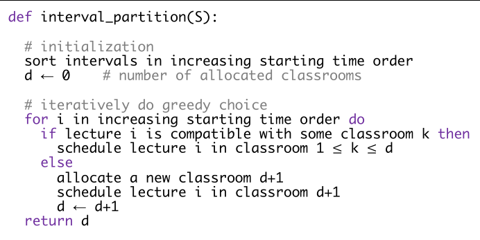

* huffman encoding pog
* runs in `O(n + d log d)`, d distinct characters
* every pair of leaves are siblings

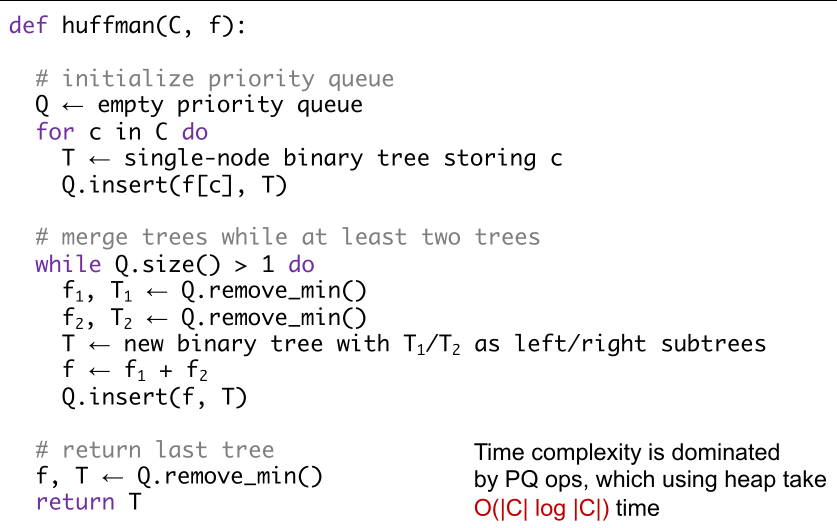


# WEEK 10 DIVIDE AND CONQUER

1. *divide* 
	-> base case, solve directly
	-> break up the problem into parts
2. *recur*
	-> recursively solve each sub-problem
3. *conquer*
	-> combine the solutions into overall solution

* we always round up if its even
*binary search* we divide by two (looking at middle element), discard one half, repeat

` If x is in A before the divide step, then x is in A after the divide step`, the part that we recurse on will have the element within the part.  

**recurrence formula**
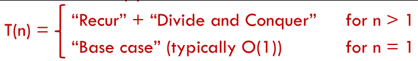
divide step: cost in terms of n `O(1) for find middle, compare to x`
* this is constant, because we keep track of what is the (moving) start, end and middle

recur step: cost in terms of T(smaller values) `solve subproblem is T(n/2)`
conquer step: cost in terms of n `return answer from recursion O(1)`

```
T(n) = T(n/2) + O(1) {n > 1}
	 \ O(1) 		 {n = 1}

T(n) = O(log n)
```
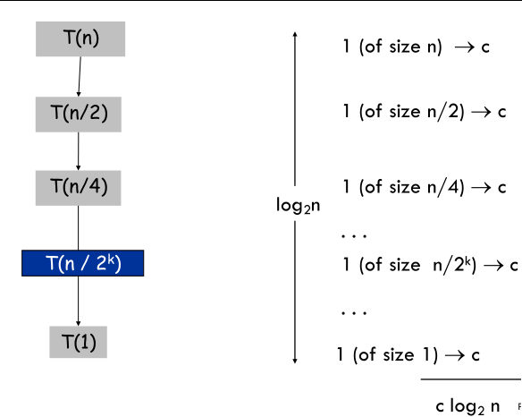
* we keep one instance, but are halfing the amount left an amount of  times
* which is log n 

* for a linked list, the finding the middle part, takes O(n)
so its:
```
T(n) = T(n/2) + O(n) {n > 1}
	 \ O(1) 		 {n = 1}

to find middle:
1st time: go n/2
2nd time: go n/4 ...
kth time: go n/2^k
this is < n
so O(n)
```


**merge sort**
* split in half, until 2? terms
* when joining back, keep a pointer to the minimum term in each half, checking and adding `O(n)` time
* array of side 1 is already sorted
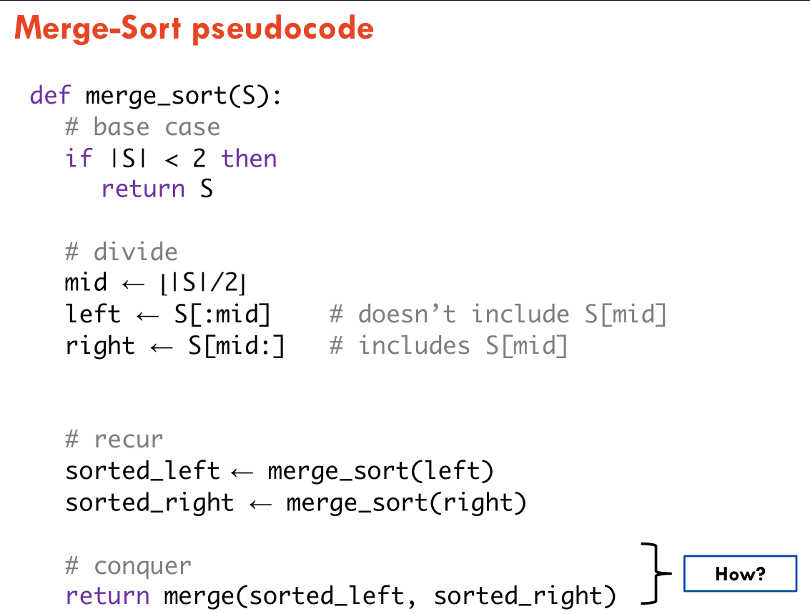
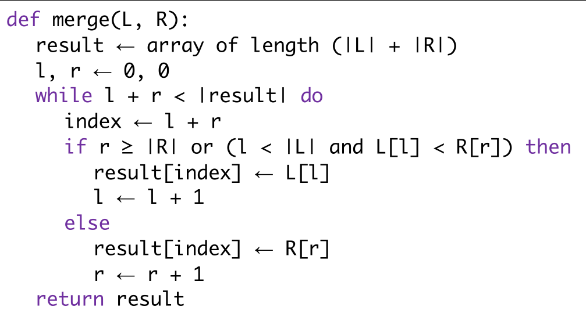

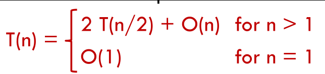

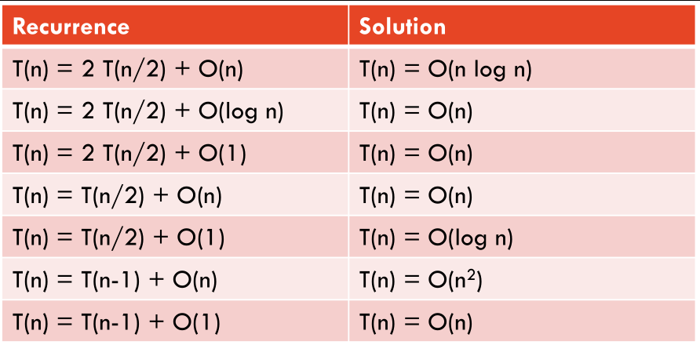

**quick sort**
* choose a random element of the list, pivot
* partition into 3: less than ,equal to, greater than
* recursively sort the less than, greater than lists
* join them back up

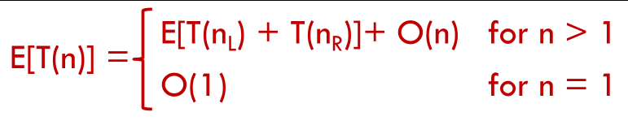
* `O(n log n)` time

* comparison based algs take omega(n log n) time
* These algorithms work by performing pair-wise comparisons between elements of the sequence we are trying to sort
* 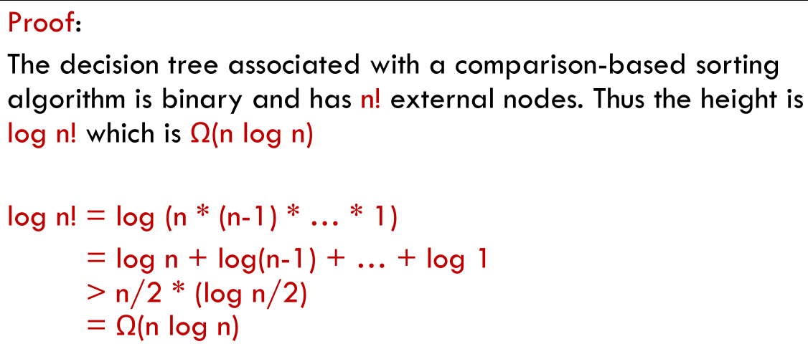