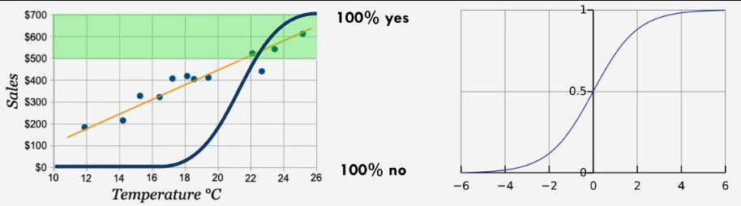
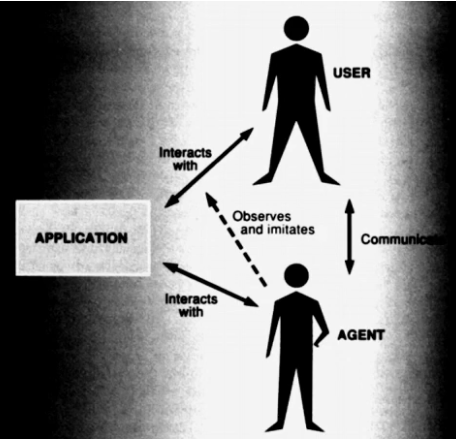

**DECO3100: Information Visualisation Design Studio**

# WEEK 1 Designing with Data
## LECTURE
* sankey diagram is the flowy splitty one
* datavis reduces complexity and provides understanding: who for
* datavis should communicate what the audience wants! as concisely as possible!
* relationships! schematics! (like a subway map)
*polyseimus*

* what is it trying to communicate:
rating graph webscrapes the IMBD of shows and movies to present infographics that may be useful when deciding to watch, or as a entertainment tool while watching a television or movie show. 

* is it concise?
* is it compelling?


# WEEK 2 Storytelling with Data
## LECTURE
`datavizproject.com`
* worked as a visualisation designer?
* points! lines! shapes! volumes!
* size! angle! color! texture! shape!
* charts are compositions of these, mapped to variables

*categorical* non number things without inherent order
*ordinal* non number things with inherent order
*discrete* countable things
*continuous* things that vary and change

*preattentive atributes* things you percieve before you really recognise them
* shape, enclosure, width, saturation, colour, shape, markings, oreintation, position, 3d, length, curavture, density, closure, sharpness ...

* small multiples: aligning multiple things on different dimensions around (like several maps in a grid over time)

**making your point**
* is it *exploratory* it helps user answer questions
* is it *explanatory* guides users to specific insights

* who is your audience: what are their needs, what are their skills (about the topic, about data interpretation)
* what is the context will it be viewed: what medium? single viewing? repeated viewing?
* what data do you have? what variables, type of data, missing data, what are the elements?

*what are the key questions/insights your user can answer/discover with the data you have?*
* inforgraphic gotta be engaging btw! have a big surprising fact, with a onboarding process to lead to it
* journey maps can help: first thing they digest > hook > keeps them going > the reveal > call to action, etc.
	* plotting out emotional experience

**chartjunk** addition of extraneous information to data visualisations that serve no purpose
* aesthetics are never extraneous to communication :o
	* has to do with purpose: is it to surprise, to engagement


# WEEK 3 Data-driven Experiences
*usability* it fufills the use and fulfills its purpose
* testing within all parts of product design: early idea, concept testing, usability testing, user-acceptance testing, customer feedback
* need to figure out what you have to test before you can figure out what your going to prototype

**concept testing considerations**
* the potential idea of an ideal, the componets of the idea that have potential, the required capital for realising the idea

**usability testing considerations**
* does the concept articulate the value prop effectively
* considerations for UX
* what wireframe artefacts had an impact on the user
* considerations for colour/branding
* behaviours and workflows need to be supported


our tests: help answer what tests resonate/dont responate with our users
* what we have to measure, suring up things we are not sure about
* tests are informed by the one before them

*seven steps*
research: what do the users needed
* purpose, audience context, data

strategy: what is the value proposition
* user insight journey, visualiation guide them towards these

concept: how do we adress the value prop
* how should it flow together, what sort of visualisations, what needs to be prominate, what details do we need

prototype and approach: what do we need to check and what is the smallest thig we can build to do it
* do users clearly understand our story
a1! questions, wanna understand tensions going through the user journey
* `what are you seeing?`
* `whats the highest/lowest/worst/best?`
* `what caused this?` (causative information)
* `is the trend good or bad` (temporal component)
* `what do you think this viz is trying to tell you`, better catpure the story based on this

synthesis and considerations: which parts worked, what needs to be changed? what was embedded in our proposition.
* did the inisght journey follow the planned route
* in what order did they follow the elements
* did it have the expected emotional response

---
**value prop**
purpose:
showing the growth of internet pentration in recent times
people wanting to see how different parts of the world have had accsess to internet
see what countries are developing fast! for what reasons?

**audience**
people intrested in seeing where new internet markets are rapidly opening up, opportunties within that space

value proposition -> insights:
this is useful because we need to understand what coutries have potential for growth, are growing, or have finished growth


# WEEK 4 Time & Relative Dimensions in Space

* temporal data: can be shown in line graphs
* can show things cyclically for temporal data as well
* can also be an animation, time not on an axis
* ranges: histogram, distribution
* fan chart: future predictions become area graphs

* clorapeth: colouring of a map based on a dataset
* bivarient: when it has combined thing
 
* manipulating your data is manipulation
* its difficult to predict the weather; chaos: from changes in data affecting a lot

*accurate* close to truth
*precise* as certain as possible
---

# WEEK 5 Data Science for Designers

`approximate answer to the right question better than, than an exac question to the wrong question`

* how do we describe this data?, discriptive things
* how is it distributed?
* how do the varaibles in the data relate?

* distributions: standard distribution, or skewed distrubution (where median and mean are on different points)
	* end tail if median > average
*median* the middle value
*mean* the average
*interquartile range* groupings of 25% of data

*historgram* number of datapoints in a range, in bins of specific quartiles

**variance, covarience, and independence**
*correlation* moves together
*causation* one made the other happen
* controlled experiments test this (random controlled experiemented, placebo and vaccine what not)

*statistical relationship* does knowing this one thing help me guess this other thing
*statistical independence* opposite

*variance* how much does data differ from the mean (how much data there is from the mean)
* 2/3 is within 1 standrd deviation (in a bellcurve)

mean of 5, sd 1 -> 2/3 between 4-6
mean of 5, sd 3 -> 2/3 between 2-8


*covariance* how much does one thing explain the other

correl -> above 0.5 (p2 = 25%) is strongly related
higher is extremely strong
* what percentage of the variance is the other one, p^2 (explained variance)

6 numbers: x mean, x stdev, y mean, y stdev, correlation


excel: data tools > delimeter
date() function to convert to months

lookup table: =UNIQUE(array)
VLOOKUP, HLOOKUP, XLOOKUP (not first column)
use $ sign to set to absolute value: `f4`

can you "data > text columns" to split columns
split by brackets

=ISBLANK()

sheets: can use split tool

# WEEK 6 Correlation, Causality & Data Science Casualties
* institute for propaganda analysis: propaganda is all content
* hyperpartisan!

*glittering generalities* great but vauge things
*name calling* dont need to provide evidence, just a character statement
*transfer* asscribing properties to another thing through association 
*card stacking* presenting only the good/bad sides of an argument
*testimonial* doing an argument from the perspective of someone
*plain folks* it doesnt seem right to me
*band wagon* implies that everyone else already believes this

* atoms to bits
* digital age prediction: decentralizing (?), globalisaing, harmonizing (?), empowering

* biased means "make assumption" (not just having an agenda)
* data, audience, context, purpose - assumptions underlying these allow us to inject bias into insights

* injecting specific information into one group bad
* implicit bias! amsumptions from the user and selection, 
* unrepresented, less visible people dissapear

**ethics**
* the wire; the impacts of data lead to improper changes -- increase of a specific crime in a district -> reduction of reporting of that crime

*identifiability/pseudonymisation* given the data you have can you figure who it is (bad)

*ownership/access* while data about someone, it is also data of someone using the services of something else; how do we navigate ownership

*consent/reusability* data reuse, do they need an active consent?

*rectifiability/erasure* is it your right to fix incorrect data
 
susskind: forms of power, `force (to make certain choices) , scrutiny (survillence) and perception control (controlling what they think is true)... digital technology will give them a potency`

* how charts lie, alberto cairo
* not tricking people takes testing
* dont try to have an argument that can go further than you can support is bad
	* vauge data can sow doubt

##TUTORIAL

CDN link:
```js
<head>
	<script src="https://cdn.plot.ly/plotly-latest.min.js"></script>
</head>
```

*setting up plot*
```js
<div id="myPlot"></div>

var plotDiv = document.getElementById('myPlot');

const plotDiv = document.getElementById('myPlot');
//constant variable, doesnt change throughout code

//object
var plotData = {
	x: [1, 2, 3, 4, 5],
	y: [1, 2, 4, 8, 6]
}


Plotly.newPlot(plotDiv, [plotData]);
//Library.plotFunction(HTMLElement //data is nested inside here, dataObject)
//takes data, creates plot, applies to div element

```

# WEEK 7 Artificial Intelligence for Designers
* what is real intelligence? the goalposts keep moving depending on technology `AI is whatever hasnt been done yet`
*intelligent agent* agent exists seperate from the environment its embedded in, input > reasoning (rules) > output
* goal based agents, have an internal state, understanding of what actions will do (object permanence)
* rule based systems / if statements (constraint solver algorithm is one)
* these programs dont have an understanding, just logic

**assessment feedback**
* justify design decisions: colour decisions, layout choices, supported by color theory, gestalt, ...


# WEEK 8 Neural Networks & Deep Learning

* learning is *association*

*decision function* 0 no, 1 is yes
 `y = 1 / (1 - e^-k(x-b))`
* `k` affects the steepness of the S (rapid v. slow)
* `b` the midpoint, where its 0.5

* the decision boundary (defined by AI) incrementally changes from new information
`new_model = old_model + learning_speed * error`
* learning speed is like 0.01

* calculus shows contribution of an individual neuron (in a neural network) to the overall error through *back propagation*

*tensor* an array with more than 2 variables
* reinforcement learning / unsupervised learning is more abstracted

# WEEK 9 Data for Good: Education, Journalism & Accountability
*wicked problems* things to complex to tackle them piece by piece
* modularising doesnt work in the world of design
* visualising systems help with prioritisation

*data journalism* 
* visual journalism (diagramatic thing)
* can realise what is obvious, but less

*leaktivism* release of classified material to journalists
* graph visualisations!! holds data

# WEEK 10 Designing Visual Analytics
* interactive analytics are an *exploratory system*
* dashboard! figure out what is the most important indicators to display
* readable at a glance

*progressive disclosure* design pattern for showing little, but how to find more 
* need ways to engage with things more
`gapminder.org`

* what goals will the user have, are there different groups of users, how long will they spend engaging with it, *how can i use my screen real estate effectively (incorportating past things)*

# WEEK 11 Visualising Connections
* systems
* bus need to come at regular intervals rather than times!!

* many pieces, irreducible, emergent phenomena (wicked problem?)
* graph visualisation
*cord diagram* sankey everything is conected together in a circle

small network
scale free networks (when there is a few with a lot, many without many)

(groups with limited connected) clique vs. hubs

## TUTORIAL

* TSNE
* clustering algorithim: dbscan, spectral clustering look nice


# WEEK 12 From Tool to Team-member: Human–AI Collaboration

*subseratoum*
*zuhandenheit* readiness to hand; know how to use an object to enact agency, intuative grasp of it - extension of self
*vorhandenheit* present to hand; broken tools, you have to consider its presence of object
* traditional way of thinking, is mastering, learning readiness to hand going to continue to be imporant

`smart tools interject, because how smart could something be if it cant disagree`
* concentpually subservianet still
* is it a tool or a creator
* mixed-initiative UI

* dialogic medium
* designing for digital collaborators, interfaces to make that helpful

# WEEK 13 Entirely Inaccurate Predictions about the Future of AI

